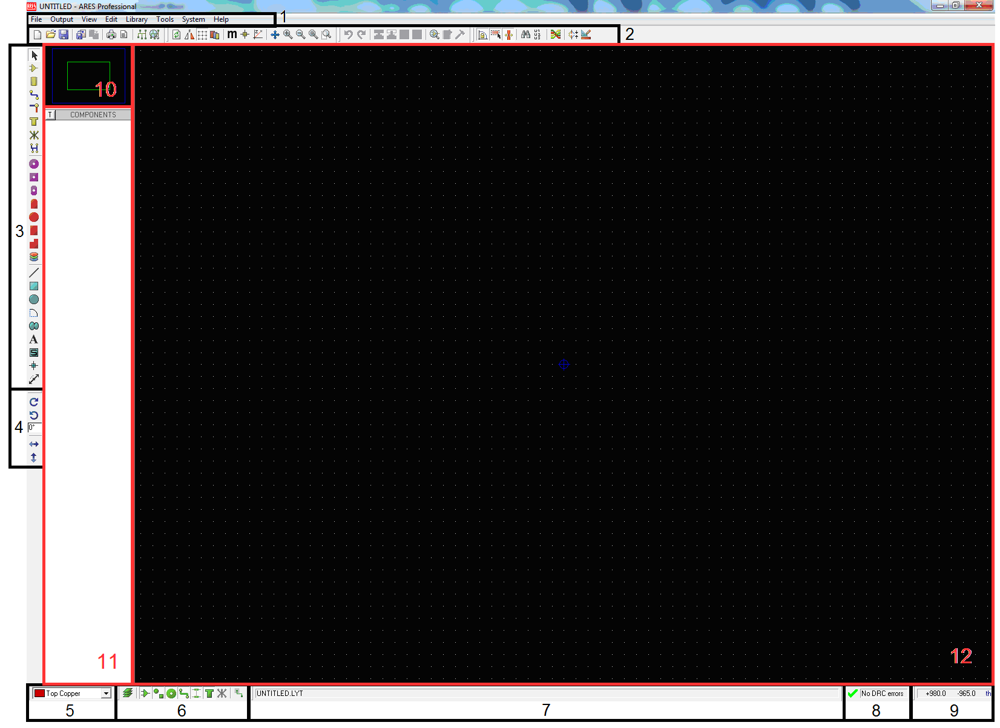
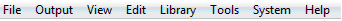

# Интерфейс программы ARES

На рис. 1 приведено основное окно программы ISIS с основными элементами интерфейса.

1 – главное меню; 2 – верхняя панель инструментов; 3 – левая панель инструментов; 4 – иконки поворота/отображения объекта; 5 – селектор слоев; 6 – фильтр для выбора объектов; 7 – панель задач; 8 – окно состояния программы проверки правил проектирования печатной платы; 9 – окно координат курсора мыши; 10 – окно предварительного просмотра; 11 – селектор объектов; 12 – основное окно редактирования.

Рассмотрим главное меню программы Proteus ISIS (Рис. 2).

 

Главное меню программы расположено в верхней части программы. При выборе определенной команды на панели задач отображаются соответствующие подсказки, о том, что она делает.

