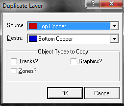

# Меню Edit

<strong>Undo (Ctrl+Z)</strong> – отмена последнего действия. По умолчанию допустимо отметить до 20 последних действий. Изменить количество можно через меню <strong>System → Set Environment…→ Number of Undo Levels</strong>.

<strong>Redo (Ctrl+Y)</strong> – возврат последнего отмененного действия. Активна только после <strong>Undo</strong>.

<strong>Cut to clipboard</strong> – вырезает выбранный элемент или область в буфер обмена.

<strong>Copy to clipboard</strong> – копирует выбранный элемент или область в буфер обмена.

<strong>Paste from clipboard</strong> – вставляет выбранный элемент или область из буфера обмена.

<strong>Align (Ctrl+A)</strong> – выравнивает группу элементов в выделенной области:

<ol>
<li><strong>Align Left Edges</strong> – по левому краю;</li>
<li><strong>Align Top Edges</strong> – по верхнему краю;</li>
<li><strong>Centre Vertically</strong> – по центру вертикально;</li>
<li><strong>Centre Horizontally</strong> – по центру горизонтально;</li>
<li><strong>Aligh Right Edges</strong> – по правому краю;</li>
<li><strong>Aligh Bottom Edges</strong> – по нижнему краю.</li>
</ol>

В выпадающем списке <strong>Align Items Using</strong> можно выбрать выравнивание по границам объекта <strong>(Object Bounds)</strong>, границам контактных площадок <strong>(Pad Bounds)</strong> или центрам контактных площадок <strong>(Pads Centres)</strong>.

<strong>Replicate…</strong> – позволяет скопировать выделенные объекты с определенным смещением по оси X и/или Y (Рис. 29). В разделе <strong>Duplication</strong> диалогового окна можно выбрать параметры копирования, а именно смещение по оси X <strong>(X-Step)</strong>, смещение по оси Y <strong>(Y-Step)</strong>, количество копий <strong>(No. of Copies)</strong>. Раздел <strong>Re-Annotation</strong> позволяет автоматически перенумеровывать копируемые объекты, например, если копируются компоненты или контактные площадки. В этом случае значение, на которое необходимо увеличить номер следующего объекта задается в поле <strong>Increment</strong>.

Рис. 29

<strong>Send to back (CTRL+B)</strong> – отправить элемент на задний план. Используется при создании и редактировании компонентов.

<strong>Bring to front (CTRL+F)</strong> – выдвинуть элемент на передний план. Используется при создании и редактировании компонентов.

<strong>Convert Vias to Pads</strong> – преобразовывает все переходные отверстия <strong>(Vias)</strong> в выделенной области в круглые сквозные контактные площадки <strong>(Pads)</strong>. Эту команду можно использовать, если необходимо соединить переходное отверстие с областью металлизации. Кроме того, после этого становится возможным редактирование преобразованного переходного отверстия через контекстное меню.

<strong>Duplicate Layer</strong> – копирует объекты из одного слоя в другой слой (Рис. 30). В выпадающем окне <strong>Source</strong> выбирается слой, из которого копируются объекты, а в окне <strong>Destn.</strong> – слой куда копируются объекты.

Рис. 30

Учтите, что скопировать можно не все объекты, а только указанные в разделе <strong>Objects Types to Copy</strong> (например, скопировать компонент или контактные площадки не получится). Установленный флажок <strong>Tracks?</strong> позволит скопировать дорожки, <strong>Graphics?</strong> – двумерную графику, <strong>Zones?</strong> – области металлизации.

<strong>New Component…</strong> – создает новый компонент (Рис. 31).

Рис. 31

В поле <strong>Name</strong> необходимо ввести название компонента, в поле <strong>Value</strong> – номинал компонента, в поле <strong>Package</strong> – существующий корпус, сохраненный в библиотеках корпусов. Если указанного корпуса не существует, то ARES выдает предупреждающее сообщение <strong>Package ‘&lt;название корпуса&gt;’ not found!</strong> (Корпус &lt;название корпуса&gt; не найден) на панели задач.

<strong>Mitre</strong> – производит срезание всех дорожек на печатной плате под углом 45 градусов (Рис. 32). Эта команда обычно используется после разводки всех дорожек, чтобы минимизировать их длину и/или избежать скопления припоя в углах дорожек.

Рис. 32

Настройки этого диалогового окна определяют минимальное <strong>(Minimum Distance)</strong> и максимальное <strong>(Maximum Distance)</strong> расстояние, которое будет использоваться, для того чтобы срезать или не срезать дорожку (Рис. 32). Для большинства плат идеально подходят значения, выбранные по умолчанию.

<strong>Unmetre…</strong> – пытается вернуть всем дорожкам на печатной плате вид, который они имели до применения команды <strong>Mitre…</strong>. Команда может использоваться, например, если пользователь вручную срезал часть дорожек; в этом случае их можно вернуть к первоначальному не срезанному состоянию с помощью глобальной команды <strong>Unmitre…</strong>. Использование команды <strong>Unmitre…</strong> после команды <strong>Mitre…</strong> не гарантирует, что плата вернется в первоначальное состояние до срезания дорожек. Если необходимо отменить непосредственно операцию <strong>Mitre…</strong>, то нужно использовать команду отмены последней операции (сочетание клавиш CTRL+Z по умолчанию). Перед выполнением операции ARES выводит сообщение, предупреждающее о глобальном применении команды. Подтвердить выполнение команды можно, нажав на кнопку OK, отменить – кнопкой Cancel.

<strong>Tidy</strong> – позволяет осуществить глобальную очистку проекта. Команда осуществляет:

<ul>
<li>удаление из окна селектора объектов все компонентов, не используемых в текущий момент в проекте, т. е. удалятся все, кроме тех, которые установлены в основном окне редактирования. Это уменьшает потребление памяти, а также упрощает выбор тех объектов, которые действительно используются.</li>
<li>удаление всех корпусов, которые находятся вне рабочей области проекта (синий прямоугольник).</li>
<li>удаление нежелательных избыточных узлов между участками дорожек, которые могут появиться при их редактировании. Эти узлы занимают дополнительное место в памяти, а также ухудшают качество дорожек при печати.</li>
<li>удаление дорожек и переходных отверстий цепи VOID, мигающих желтым цветом.</li>
</ul>

