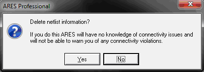
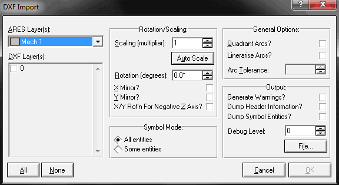
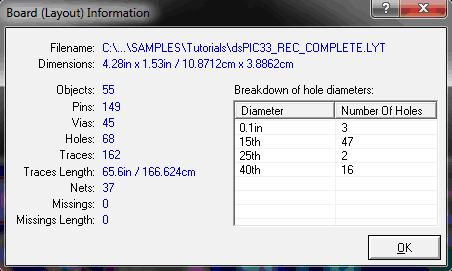

# Меню File

ARES поддерживает следующие типы файлов:

<ul>
<li>Файлы разводки печатной платы (*.LYT);</li>
<li>Файлы резерной копии разводки печатной платы (*.LBK);</li>
<li>Файлы участка печатной платы (*.RGN);</li>
<li>Файлы библиотек (*.LIB);</li>
<li>Файлы списка соединений (*.SDF).</li>
</ul>

Файлы разводки печатной платы содержат всю информацию о печатной плате и имеют расширение «LYT». Они содержат копии всех корпусов и стилей, используемых на плате, поэтому весь проект может быть перемещен на другой компьютер копированием только файла разводки. Резервные копии файла разводки создаются при сохранении существующего файла и имеют расширение «LBK».

Участок платы может быть экспортирован в файл участка (с расширением *.RGN) и затем открыт в другом файле разводки (c расширением *.LYT). Они создаются и открываются командами <strong>Import</strong> и <strong>Export</strong> меню File и аналогичны файлам секций в ISIS. Файлы участка в ARES представляются в формате ASCII, что позволяет опытному пользователю вручную редактировать базу данных разводки или даже написать программное обеспечение для осуществления специализированных операций над ней. Также возможен импорт данных из других пакетов проектирования печатных плат.

Библиотеки корпусов и символов имеют расширение «LIB». Смотри также раздел «Работа с библиотеками».

Родным форматом в ISIS и ARES для файлов списка соединений является расширение «SDF», расшифровывающееся как Schematic Description Format (Формат Описания Принципиальной Схемы). Смотри также раздел «Работа со списком соединений».

Файлы отчета о проверке правил соединений имеют расширение «CRC». Смотри также раздел «Проверка правил соединений».

<strong>New Layout</strong> – создает новый пустой проект, закрывая все открытые. Если проект был изменен, но не сохранен, перед созданием нового проекта открывается диалоговое окно позволяющее сохранить текущий проект. Файлу присваивается название по умолчанию «UNTITLED», пока вы не измените его командой <strong>Save Layout</strong> или <strong>Save Layout As…</strong>.

<strong>Load Layout (Cntl+O)</strong> – открывает файлы программы ARES. Если проект был изменен, но не сохранен, перед открытием другого проекта открывается диалоговое окно позволяющее сохранить текущий проект. Файл разводки печатной платы может быть загружен несколькими способами:

<ul>
<li>Из командной строки: ARES "название файла разводки";</li>
<li>Используя команду Load Layout из меню ARES;</li>
<li>Двойным щелчком на файле в проводнике Windows.</li>
</ul>

<strong>Save Layout (Cntl+S)</strong> – позволяет сохранить печатную плату в выбранный каталог на диске в любой момент времени. Печатная плата сохраняется в тот же файл, из которого она была загружена; при этом расширение старого файла изменяется на «LBK», а название файла на ‘Backup of "название файла"’ («Резервная копия "название файла"»). Если использовалась команда <strong>New Layout</strong> для создания файла, то файл сохранится с именем «UNTITLED.LYT», если не будет выбрано другое название в диалоговом окне сохранения.

Когда файл разводки сохраняется, любой существующий до этого файл на диске копируется или как последний загруженный файл или файл резервной копии. Для файла разводки с именем «MYFILE.LYT» последний загруженный файл имеет название «Last Loaded MYFILE.LBK», а файл резервной копии «Backup Of MYFILE.LBK». Заметьте, что последние загруженные файлы и файлы резервных копий имеют другое расширение (LBK) и поэтому не появляются в диалоговом окне <strong>Load Layout</strong>. Чтобы увидеть эти файлы при загрузке нужно изменить поле Тип файлов (внизу диалогового окна) на «Backup Layout Files» (Файлы резервных копий разводки).

Для нового файла разводки процесс создания резервной копии работает следующим образом. Первая операция сохранения сохраняет файл разводки. После каждого следующего сохранения, любой существующий файл резервной копии удаляется, существующий файл разводки переименовывается в резервный файл и затем файл разводки сохраняется.

Для существующего файла разводки, процесс создания резервной копии немного отличается. Первая операция сохранения после загрузки файла удаляет любой последний загруженный файл и переименовывает текущий файл как последний загруженный. Каждое последующее сохранение (после редактирования разводки) приведет к стандартной схеме создания резервной копии, т. е., при каждом сохранении любая существующая резервная копия удаляется, существующий файл переименовывается как файл резервной копии и затем сохраняется файл разводки.

Это означает, что файл разводки (MYFILE.LYT) всегда имеет последнюю сохраненную версию разводки и файл резервной копии (Backup of MYFILE.LBK) – это обычно версия файла до последнего сохранения. Последний загруженный файл (Last Loaded MYFILE.LBK) – это версия файла разводки, которая была последний раз успешно загружена и представляет версию разводки в начале редактирования в течение текущей сессии работы ARES, не зависимо от того сколько раз вы сохранили файл разводки во время этой сессии.

<strong>Save Layout As…</strong> – позволяет сохранить разводку печатной платы в файл в выбранном каталоге с другим именем.

<strong>Clear Netlist</strong> – очищает информацию о текущем списке соединений. При этом выдается окно с сообщением показанное на рис. 3. В нем выдается предупреждение о том, что в случае удаления списка соединений, ARES не будет иметь информации о соединениях между компонентами и не сможет предупреждать пользователя в случае каких-либо ошибок соединений. Нажатие на кнопку Yes удалит список соединений, а на кнопку No – отметит операцию удаления. Смотри также раздел «Работа со списком соединений».

Рис. 3

<strong>Load Netlist…</strong> – позволяет загрузить новый список соединений поверх старого. При выборе команды появится диалоговое окно, позволяющее выбрать название файла списка соединений. Смотри также раздел «Работа со списком соединений».

<strong>Save Netlist…</strong> – позволяет сохранить информацию о текущем списке соединений на диск. При выборе команды появится диалоговое окно, позволяющее задать название файла и каталог для его сохранения, независимо от того был ли сохранен файл ранее. Эту команду можно использовать в следующих случаях:

<ol>
<li>как способ проверки соединений, когда не доступна принципиальная схема,</li>
<li>в случаях, когда необходимо повторно развести плату, без риска случайного изменения её связей, не имея принципиальной схемы,</li>
<li>в случае создания принципиальной схемы из Gerbit или другой программы,</li>
<li>для отладки, когда есть сомнения в том, что печатная плата не соответствует принципиальной схеме.</li>
</ol>

В случае, когда файл разводки содержал список соединений, будут использоваться названия цепей, используемые в этом списке соединений. В противном случае будут автоматически сгенерированы числовые названия цепей. Смотри также раздел «Работа со списком соединений».

<strong>Import DXF…</strong> – запускает DXFCVT преобразователь полностью интегрированный в ARES. Он помогает импортировать механические данные в формате DXF и может использоваться в тех случаях, когда плата должна помещаться в существующий механический корпус, а также для импорта другой графики, например, логотипов компаний. Смотри также раздел «DXFCVT преобразователь». При импортировании открывается диалоговое окно, показанное на Рис. 4.

Рис. 4

Через раскрывающийся список <strong>ARES Layer(s)</strong> выбирается слой или слои, на которые необходимо импортировать DXF файл. Раздел <strong>DXF Layer(s)</strong> позволяет выбрать DXF слой или слои, которые необходимо импортировать на указанный слой в ARES. Каждый DXF слой можно импортировать на различные слои в ARES, однако, для этого нужно использовать команду <strong>Import DXF…</strong> несколько раз для различных слоев в ARES. Кнопка <strong>All</strong> позволяет выбрать все слои, а <strong>None</strong> – снимает выделение со всех слоев.

В разделе <strong>Rotation/Scaling</strong> определяется поворот и масштаб импортируемого файла. Поле <strong>Scaling (multiplayer)</strong> позволяет выбрать соответствующий масштабный коэффициент для импорта. Единицей введенного коэффициента являются дюймы. Кнопка <strong>Auto-Scale</strong> позволяет настроить масштабный коэффициент автоматически. В поле <strong>Rotation (degrees)</strong> вводится требуемый поворот импортируемого изображения в градусах. Установленный флажок <strong>X Mirror?</strong> позволяет отразить импортируемое изображение горизонтально, а флажок <strong>Y Mirror?</strong> – вертикально. Установленный флажок <strong>X/Y Rot’n For Negative Z Axis?</strong> осуществляет двумерное вращение для компенсации тех объектов, которые имеют отрицательную координату Z в трехмерном импортируемом файле.

В разделе <strong>Symbol Mode</strong> определяется, что происходит с объектами, находящимися на различных DXF слоях, когда возникают конфликты при импортировании в ARES. Это происходит, когда объект находится на разных слоях, не все из которых выбраны для импортирования в ARES. Возможны следующие случаи:

<ul>
<li>переключатель <strong>All Entities</strong> позволяет импортировать все части объекта, если хотя бы одна из них находится на слое, выбранном для импортирования;</li>
<li>переключатель <strong>Some Entities</strong> позволяет импортировать только те части объекта, которые находятся на слое, выбранном для импортирования.</li>
</ul>

В разделе <strong>General Options</strong> определяется обработка дуг с углами больше 45 градусов. Когда установлен флажок <strong>Quadrant Arcs?</strong> любые дуги больше 45 градусов разбиваются на несколько дуг с углами 45 или меньше градусов в зависимости от первоначального угла дуги. Когда установлен флажок <strong>Linerarise Arcs?</strong> дуга аппроксимируются последовательностью отрезков. Степень аппроксимации может быть определена с помощью поля <strong>Arc Tolerance</strong>. Диапазон значений для этого поля равен от 0 до 100. Чем меньше значение, тем больше точность. Нулевое значение соответствует аппроксимации, когда средняя точка отрезка составляет не больше одного пикселя длины дуги.

В разделе <strong>Output</strong> определяется отладочная дополнительная информация, которая выводится при импортировании в файл, указанный через кнопку <strong>File…</strong>. Установленный флажок <strong>Generate Warnings?</strong> приводит к записи в файл преобразователем предупреждающих сообщений в случаях, которые могут привести к нежелательному импорту. Например, в случае считывания любых строк и игнорирования их из-за невозможности их преобразовать. Включение этой функции замедляет процесс преобразования, но может помочь в случаях возникновения проблем, возникающих при импорте. Установленный флажок <strong>Dump Header Information?</strong> выдает в файл значения переменных из раздела HEADER, которые он считывает из DXF файла. Сам преобразователь не использует эти значения, но их может использовать пользователь. Установленный флажок <strong>Dump Symbol Entities?</strong> выдает в файл графические примитивы, считанные из каждого объекта BLOCK. Это можно использовать для отладки блочных объектов, которые не были правильно преобразованы или экспортированы. Поле <strong>Debug Level</strong> определяет сколько отладочной информации будет выводиться в файл. Диапазон значений для этого поля меняется от 0 до 10.

Импортирование и запись в файл, указанный при отладке, происходит после нажатия на кнопку <strong>OK</strong> диалогового окна, кнопка Cancel отменяет операцию импорта. Кнопка OK не активна, пока не выбран хотя бы один слой в разделе <strong>DXF Layer(s)</strong>.

<strong>Import Bitmap…</strong> – позволяет поместить картинку в проект. Картинка должна быть в формате <strong>BMP</strong> с глубиной не более 256 цветов. Команда может использоваться для импорта другой графики, например, логотипов компаний.

<strong>Import Region…</strong> – открывает участок печатной платы из файла участка. Некоторые сложности могут возникнуть при попытке импортировать область, сохраненную из файла разводки печатной платы, в котором используемые стили контактных площадок/дорожек/переходных отверстий отличаются от стилей, используемых в текущем файле. Файлы участков не сохраняют эту информацию, поэтому при импорте файла участка все стили контактных площадок/дорожек будут иметь значения по умолчанию. Решением этой проблемы является создание новых стилей в первом файле, в которых отражены необходимые модификации. Затем можно создать печатную плату и экспортировать/импортировать её через файлы участков в другие проекты.

<strong>Export Region…</strong> – создает файл участка со всеми выделенными объектами. Выделите необходимый участок платы с помощью выделяющего прямоугольника и вызовите команду. В открывшемся диалоговом окне выберите существующий файла участка или задайте название для нового.

Файлы участков могут быть также загружены через команду <strong>Load Layout</strong>; эта команда может также использоваться при загрузке данных, созданных внешними программами преобразования DXFCVT и GERBIT.

Файлы участков лучше не использовать для мультиплицирования (панелирования) печатных плат (создания несколько одинаковых плат на одной заготовке) для производства, поскольку теряется информация о списке соединений и импортированные области металлизации теряют связь с цепью, к которой они подсоединяются. Для мультиплицирования лучше использовать <strong>Gerber Viewer</strong>, вызываемый командой <strong>Gerber View…</strong> из меню <strong>Output</strong>.

<strong>Mail To…</strong> – открывает почтовый клиент и позволяет послать текущий проект по электронной почте.

<strong>Board Statistics…</strong> – выдает краткую статистику по печатной плате, загруженной в данный момент (рис. 5).

Рис. 5

Поле <strong>Filename</strong> – полный путь к файлу разводки печатной платы. Также отображается на панели задач, когда курсор мыши указывает на пустую область в основном окне редактирования.

Поле <strong>Dimensions</strong> – размер печатной платы в дюймах (in) и сантиметрах (cm). Определяется, используя границы печатной платы.

Поле <strong>Objects</strong> – количество объектов на печатной плате.

Поле <strong>Pins</strong> – количество выводов на печатной плате.

Поле <strong>Vias</strong> – количество переходных отверстий на печатной плате.

Поле <strong>Holes</strong> – количество сквозных отверстий на печатной плате.

Поле <strong>Traces</strong> – количество дорожек на печатной плате.

Поле <strong>Traces Length</strong> – общая длина всех дорожек на печатной плате.

Поле <strong>Missing</strong> – количество линий связей (неразведенных соединений) на печатной плате.

Поле <strong>Missing Length</strong> – общая длина всех линий связей на печатной плате.

Поле <strong>Breakdown of hole diameters</strong> – список диаметров сквозных отверстий, существующих на печатной плате.

Столбец <strong>Diameter</strong> – диаметр сквозных отверстий в дюймах (in) или милах (th) (тысячных дюйма).

Столбец <strong>Number of Holes</strong> – число отверстий с указанным диаметром на печатной плате.
В следующей части меню <strong>File</strong> показаны четыре последних файла, которые были открыты/сохранены в программе и пути к ним.

<strong>Exit (Q)</strong> – выход из программы Proteus ARES. Если проект был изменен, но не сохранен, перед закрытием программы открывается диалоговое окно позволяющее сохранить текущий проект.

