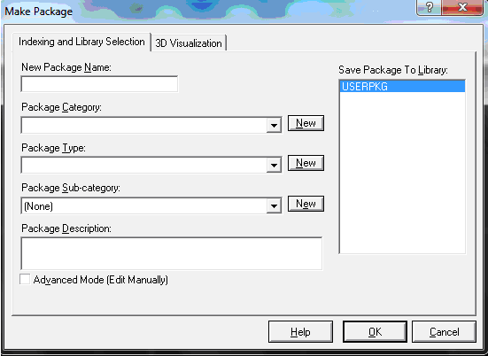
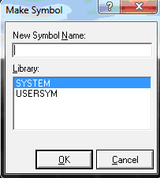
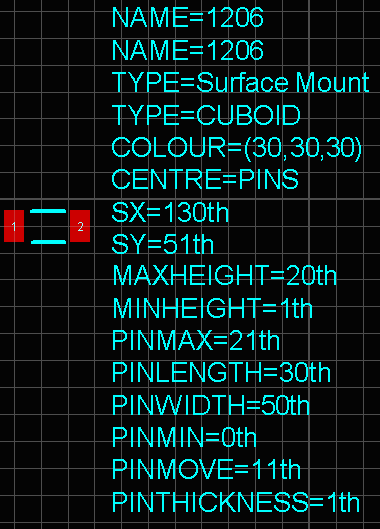

# Меню Library

Существует две библиотеки символов (разделяемые с ISIS): SYSTEM.LIB; USERSYM.LIB и шесть библиотек корпусов: PACKAGE.LIB; CONNECTORS.LIB; SMTCHIP.LIB; SMTDISC.LIB; SMTBGA.LIB; USERPKG.LIB.

Кроме того, пользователь может создавать свои собственные библиотеки, используя команду <strong>Library Manager</strong>.

USERSYM.LIB и USERPKG.LIB доступны для чтения/записи, а остальные – только для чтения. Это гарантирует, что при обновлении библиотек с сайта не произойдет перезапись объектов, созданных пользователем, с одинаковыми именами, поэтому пользователь должны добавлять элементы только в USERSYM.LIB (новые символы) и USERPKG.LIB (новые корпуса).

Если нужно изменить элементы в библиотеках доступных только для чтения, пользователь сделать их доступными для чтения/записи, используя команду Свойства в проводнике Windows.

<strong>Library Manager</strong> также позволяет изменять свойство чтения/записи библиотек.

<strong>Pick Package/Symbol… (P)</strong> – открывает браузер библиотек объектов (Рис. 33), позволяя выбирать и размещать в ARES объекты из библиотек. Каждый корпус в библиотеках корпусов связан с категорией (<strong>Category</strong>), типом (<strong>Type</strong>), подкатегорией (<strong>Sub-Category</strong>) и кратким текстовым описанием (<strong>Description</strong>). Эта информация отображается в браузере библиотек и позволяет очень легко искать требуемые корпуса в библиотеках. При поиске по ключевым словам необходимо учитывать, что:

<ol>
<li>поиск осуществляется среди названий корпусов, кратких тестовых описаний, категорий и подкатегорий;</li>
<li>если пользователь вводит несколько ключевых слов, то подразумевается, что все они входят в искомый объект. То есть, между ключевыми словами стоит логический элемент «И»;</li>
<li>если ключевое слово – число, то поиск производится по разрядам числа, стоящим в любом месте искомого объекта. Например, ключевому слову «7400» будут соответствовать объекты «74LS00», «74HC00» и т. д.;</li>
<li>если ключевое слово полностью соответствует объекту, то этот объект автоматически выделяется в результатах. Это позволяет быстрее выбирать объекты, названия которых известны;</li>
<li>если ключевое слово содержит символы подстановки «*» или «?», то они учитываются при поиске;</li>
<li>при установленном флажке <strong>Match Whole Words?</strong> поиск проводится так, чтобы ключевое слово полностью совпадало со значением свойства объекта. В противном случае допустимо частичное совпадение;</li>
<li>регистр символов не учитывается.</li>
</ol>

В средней части диалогового окна отображаются результаты поиска <strong>Results</strong>, при этом сортировка производится по названию корпуса компонента (<strong>Device</strong>), библиотеке (<strong>Library</strong>), в которой он находится, и краткому текстовому описанию (<strong>Description</strong>). Нажав правой кнопкой мыши на свободном поле, можно также выбрать дополнительные столбцы для отображения: категория (<strong>Category</strong>), тип (<strong>Type</strong>), подкатегория (<strong>Sub-Cateroty</strong>), производитель (<strong>Manufacturer</strong>), коду хранения на складе (<strong>Stock Code</strong>). Щелкнув на название конкретного столбца можно изменить порядок сортировки.

Для подтверждения выбора корпуса нажмите левой кнопкой мыши по строке с его названием. Нажмите кнопку OK и поместите корпус на схему, нажав два раза левую кнопку. В верхней правой части экрана в окне <strong>Package Preview</strong> можно увидеть выбираемый компонент. После поиска всех нужных компонентов, браузер библиотек можно закрыть щелчком по крестику вверху справа или по кнопке Cancel внизу справа. Все выбранные компоненты должны оказаться в селекторе объектов.

Существующие пользовательские библиотеки из версий Proteus до 6.6 не содержат информации о категориях и подкатегориях. Корпуса из этих библиотек попадают в категорию Unspecified, а библиотечные названия используются в качестве подкатегорий.

Если пользователь выбрал корпус или символ, который уже находится на печатной плате, ARES обновит его из библиотек, хранящихся на диске. Учтите также, что:

<ul>
<li>При выборе корпусов, необходимо учитывать, что ARES просто расположит новый корпус поверх точки привязки старого. Это означает, что контактные площадки нового корпуса могут иметь другие размеры и потребуется провести повторную разводку дорожек на плате.</li>
<li>Когда существует два или более корпуса или символа с одинаковыми именами в нескольких библиотеках, команда <strong>Pick Package/Symbol</strong> загрузит самый новый. Это удобно при редактировании одного из стандартных библиотечных элементов и размещении его в USERPKG.LIB, поскольку эта версия элемента будет считаться новее стандартной.</li>
</ul>

Рис. 33

<strong>Make Package…</strong> – команда создания корпуса в ARES. Корпус – это совокупность контактных площадок и шелкографии, которая используется при размещении компонента на печатной плате. В ARES существует несколько библиотек со стандартными корпусами, что позволяет сэкономить время, по сравнению с ручными методами разводки печатной платы. Однако бывают случаи, когда необходимо создать свой собственный корпус, поэтому ниже приводится пошаговый алгоритм создания.

<strong><em>Создание корпуса</em><strong>

Чтобы создать новый библиотечный корпус необходимо:

<ol>
<li>Выбрать соответствующую иконку формы контактных площадок (<strong>Round Through-hole Pad Mode</strong>, <strong>Square Through-hole Pad Mode</strong>,<strong> DIL Pad Mode</strong>, <strong>Edge Connector Pad Mode</strong>, <strong>Circular SMT Pad Mode</strong>, <strong>Rectangular SMT Pad Mode</strong>, <strong>Polygonal SMT Pad Mode</strong>) на левой панели инструментов и поместить площадки в свободную область основного окна редактирования. Используйте селектор слоев, чтобы разместить контактные площадки на соответствующих слоях;</li>
<li>По умолчанию ARES нумерует выводы, начиная с «1» по возрастанию в том порядке, в котором они помещаются на плату. Если нужно пронумеровать выводы в другом порядке, их необходимо пронумеровать заново, используя <strong>Auto Name Generator…</strong> или отредактировать вручную, нажав на нем правой кнопкой мыши и выбрав команду <strong>Edit Properties</strong> контекстного меню;</li>
<li>Выберите соответствующие иконки двумерной графики (<strong>2D Graphics Line Mode</strong>, <strong>2D Graphics Box Mode</strong>, <strong>2D Graphics Circle Mode</strong>, <strong>2D Graphics Arc Mode</strong>, <strong>2D Graphics Closed Path Mode</strong>) и поместите шелкографию корпуса на плате. Корпус может иметь текстовые обозначения (иконка <strong>2D Graphics Text Mode</strong>), как на стороне компонентов, так и на стороне пайки; причем они будут меняться местами, если выбрана иконка отражения по вертикали или горизонтали (<strong>X-Mirror</strong> или <strong>Y-Mirror</strong>).</li>
<li>Выделите все объекты, растягивая выделяющий прямоугольник над ними.</li>
<li>Вызовите команду <strong>Make Package…</strong> из меню <strong>Library</strong>. Появится диалоговое окно <strong>Make Package…</strong> приведенное на Рис. 34;</li>
<li>Во вкладке <strong>Indexing and Library Selection</strong> введите название в поле <strong>New Package Name</strong>, категорию в выпадающем списке <strong>Package Category</strong> или создайте новую с помощью кнопки <strong>New</strong>, тип в выпадающем списке <strong>Package Type</strong> или создайте новый с помощью кнопки <strong>New</strong>, подкатегорию в выпадающем списке <strong>Package Sub-Category</strong> или создайте новую с помощью кнопки <strong>New</strong>, краткое текстовое описание <strong>Package Description</strong> и затем выбрать библиотеку корпусов для его сохранения (доступны только библиотеки, в которые разрешена запись) – обычно это библиотека USERPKG.LIB. Установленный флажок <strong>Advanced Mode (Edit Manually)</strong> позволяет вводить данные в поля <strong>Package Category</strong>, <strong>Package Type</strong>, <strong>Package Sub-Category</strong> сразу вручную, а не из выбирать из выпадающего списка. После этого пользователь может переключиться во вкладку <strong>3D Visualisation</strong>, чтобы создать трехмерную модель корпуса или просто нажать кнопку OK, чтобы сохранить корпус в библиотеку без информации о его трехмерной модели;</li>
<li>Во вкладке <strong>3D Visualization</strong> введите трехмерную информацию, используя скриптовые команды, чтобы получить трехмерное изображение корпуса. Облегчает процесс создания окно трехмерного предварительного просмотра, которое в реальном времени обновляется при вводе или редактировании параметров. Смотри также раздел «Создание трехмерных моделей внутри ARES»;</li>
<li>Нажмите кнопку OK, чтобы сохранить корпус и трехмерную информацию о нем в указанную библиотеку.</li>
</ol>

Рис. 34

Заметьте, что описание, которое вводится в диалоговом окне <strong>Make Package</strong>, будет использоваться браузером библиотек при поиске по ключевым словам, поэтому в общем случае при создании корпуса необходимо убедиться, что описание будет содержать ключевые слова, по которым пользователь сможет легко и просто найти корпус во время поиска. Учтите также, что:

<blockquote style="margin-left:20px; color: #000;">Точка привязки корпуса может быть определена, поместив на него маркер <strong>ORIGIN</strong>. Если на корпусе нет маркера <strong>ORIGIN</strong>, то точкой привязки будет середина первого помещенного вывода. Маркеры доступны через иконку <strong>2D Graphics Marker Mode</strong> в левом меню инструментов.

Также можно определить положения, отличающиеся от выбранных по умолчанию, где будут располагаться обозначение и/или номинал (название) корпуса. Для этого поместите маркеры <strong>REFERENCE</strong> или <strong>VALUE</strong> в требуемые положения.

Обычные стили контактных площадок могут быть расположены на отдельных медных слоях или на всех медных слоях в зависимости от текущей настройки селектора слоев:

<ul>
<li>для обычных корпусов со сквозными отверстиями, пользователь должен располагать контактные площадки во всех слоях.</li>
<li>при создании корпусов для поверхностного монтажа пользователь должен располагать контактные площадки только в верхнем медном слоев. Если такой корпус размещается на стороне пайки, то контактные площадки автоматически перемещаются в нижний медный слой.</li>
<li>для двухсторонних площадок для краевых соединителей, пользователь должен располагать отдельные площадки в верхнем и нижнем медном слое.</li>
<li>если необходимо, чтобы контактная площадка имела различную форму на разных слоях для сквозного отверстия, пользователь должен использовать стеки контактных площадок.</li>
</ul></blockquote>

<strong>Make Symbol…</strong> – команда создания символа в ARES. Символ – это сгруппированные объекты двумерной графики, которые рассматриваются как один объект. Например, используя линии и текст можно создать условное графическое обозначение логического элемента И в виде символа.

Символ может быть создан, выделяя объекты, которые должны составлять его и вызывая команду <strong>Make Symbol</strong>. При этом информация о том, на каких слоях располагается двумерная графика, игнорируется. Появится диалоговое окно (Рис. 35), позволяющее ввести название символа в поле <strong>New Symbol Name</strong>, который может быть сохранен в библиотеке SYMBOL (системная библиотека символов) (или USERSYM – пользовательская) и станет доступен для непосредственного размещения из селектора объектов. Если до этого в библиотеке существовал символ с таким названием, он будет заменен новым.

Рис. 35

ARES позволяет символу состоять из других символов и/или других графических объектов. Это позволяет, например, создавать логический элемент И-НЕ из ранее созданного логического элемента И и окружности.

Как и для корпусов, точка привязки символа может быть определена размещением маркера <strong>ORIGIN</strong>.

Символы ISIS и ARES по своей сути взаимозаменяемы и все библиотеки символов имеют тип «PROTEUS SYMBOL LIBRARY» (Библиотека символов PROTEUS). Однако ARES не поддерживает все графические возможности ISIS, поэтому не гарантируется правильное изображение символов ISIS со сложным рисунком. Смотри также раздел «Создание графических символов».

<strong>Decompose</strong> – разбивает корпус на двумерную графику, контактные площадки и маркеры. Также отображает текстовый скрипт, который содержит название корпуса компонента, тип, цвет и все свойства компонента по умолчанию (Рис. 36). Аналогичным образом можно разбивать символы. Чтобы отредактировать существующий библиотечный корпус, необходимо:

<ol>
<li>выбрать иконку <strong>Package Mode</strong>.</li>
<li>выбрать корпус, который нужно отредактировать из библиотеки (используя кнопку с буквой «P» вверху селектора объектов) и поместить его в рабочую область.</li>
<li>выделить корпус правой кнопкой мыши и затем вызвать команду <strong>Decompose</strong> из контекстного меню. Это разобьет корпус составляющие его контактные площадки и двумерную графику, а также поместит маркер <strong>ORIGIN</strong> в точке привязки корпуса.</li>
<li>Отредактировать контактные площадки и графику как необходимо.</li>
<li>После окончания редактирования использовать команду <strong>Make Package</strong>, чтобы повторно создать корпус с таким же именем или в виде нового корпуса.</li>
<li>Если выбранный корпус находится в библиотеке PACKAGE, которая обычно доступна только для чтения, вы должны сохранить его обратно в USERPKG. Этот способ лучше, чем поместить корпус обратно в библиотеку PACKAGE, поскольку в этом случае при его обновлении перепишутся корпуса, отредактированные пользователем. Заметьте, что выводы будут иметь номера, которые они имели в первоначальном корпусе, поэтому разбиение корпуса DIL14 добавление двух выводов по краям и затем повторное создание корпуса, не приведет к созданию корпуса DIL16, пока пользователь вручную не перенумерует все выводы.</li>
</ol>

Рис. 36

<strong>Compile to Library</strong> – помещает размещенные на печатной плате корпуса в одну библиотеку корпусов. В открывшемся диалоговом окне можно выбрать в какую из библиотек, необходимо поместить корпуса (показаны только библиотеки доступные для чтения и записи), например, USERPKG. Учтите, что помещаемые корпуса не должны быть связаны линиями связи или дорожками для успешного выполнения этой команды.

