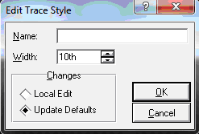

# Меню Library

Существует две библиотеки символов (разделяемые с ISIS): SYSTEM.LIB; USERSYM.LIB и шесть библиотек корпусов: PACKAGE.LIB; CONNECTORS.LIB; SMTCHIP.LIB; SMTDISC.LIB; SMTBGA.LIB; USERPKG.LIB.

Кроме того, пользователь может создавать свои собственные библиотеки, используя команду <strong>Library Manager</strong>.

USERSYM.LIB и USERPKG.LIB доступны для чтения/записи, а остальные – только для чтения. Это гарантирует, что при обновлении библиотек с сайта не произойдет перезапись объектов, созданных пользователем, с одинаковыми именами, поэтому пользователь должны добавлять элементы только в USERSYM.LIB (новые символы) и USERPKG.LIB (новые корпуса).

Если нужно изменить элементы в библиотеках доступных только для чтения, пользователь сделать их доступными для чтения/записи, используя команду Свойства в проводнике Windows.

<strong>Library Manager</strong> также позволяет изменять свойство чтения/записи библиотек.

<strong>Pick Package/Symbol… (P)</strong> – открывает браузер библиотек объектов (Рис. 33), позволяя выбирать и размещать в ARES объекты из библиотек. Каждый корпус в библиотеках корпусов связан с категорией (<strong>Category</strong>), типом (<strong>Type</strong>), подкатегорией (<strong>Sub-Category</strong>) и кратким текстовым описанием (<strong>Description</strong>). Эта информация отображается в браузере библиотек и позволяет очень легко искать требуемые корпуса в библиотеках. При поиске по ключевым словам необходимо учитывать, что:

<ol>
<li>поиск осуществляется среди названий корпусов, кратких тестовых описаний, категорий и подкатегорий;</li>
<li>если пользователь вводит несколько ключевых слов, то подразумевается, что все они входят в искомый объект. То есть, между ключевыми словами стоит логический элемент «И»;</li>
<li>если ключевое слово – число, то поиск производится по разрядам числа, стоящим в любом месте искомого объекта. Например, ключевому слову «7400» будут соответствовать объекты «74LS00», «74HC00» и т. д.;</li>
<li>если ключевое слово полностью соответствует объекту, то этот объект автоматически выделяется в результатах. Это позволяет быстрее выбирать объекты, названия которых известны;</li>
<li>если ключевое слово содержит символы подстановки «*» или «?», то они учитываются при поиске;</li>
<li>при установленном флажке <strong>Match Whole Words?</strong> поиск проводится так, чтобы ключевое слово полностью совпадало со значением свойства объекта. В противном случае допустимо частичное совпадение;</li>
<li>регистр символов не учитывается.</li>
</ol>

В средней части диалогового окна отображаются результаты поиска <strong>Results</strong>, при этом сортировка производится по названию корпуса компонента (<strong>Device</strong>), библиотеке (<strong>Library</strong>), в которой он находится, и краткому текстовому описанию (<strong>Description</strong>). Нажав правой кнопкой мыши на свободном поле, можно также выбрать дополнительные столбцы для отображения: категория (<strong>Category</strong>), тип (<strong>Type</strong>), подкатегория (<strong>Sub-Cateroty</strong>), производитель (<strong>Manufacturer</strong>), коду хранения на складе (<strong>Stock Code</strong>). Щелкнув на название конкретного столбца можно изменить порядок сортировки.

Для подтверждения выбора корпуса нажмите левой кнопкой мыши по строке с его названием. Нажмите кнопку OK и поместите корпус на схему, нажав два раза левую кнопку. В верхней правой части экрана в окне <strong>Package Preview</strong> можно увидеть выбираемый компонент. После поиска всех нужных компонентов, браузер библиотек можно закрыть щелчком по крестику вверху справа или по кнопке Cancel внизу справа. Все выбранные компоненты должны оказаться в селекторе объектов.

Существующие пользовательские библиотеки из версий Proteus до 6.6 не содержат информации о категориях и подкатегориях. Корпуса из этих библиотек попадают в категорию Unspecified, а библиотечные названия используются в качестве подкатегорий.

Если пользователь выбрал корпус или символ, который уже находится на печатной плате, ARES обновит его из библиотек, хранящихся на диске. Учтите также, что:

<ul>
<li>При выборе корпусов, необходимо учитывать, что ARES просто расположит новый корпус поверх точки привязки старого. Это означает, что контактные площадки нового корпуса могут иметь другие размеры и потребуется провести повторную разводку дорожек на плате.</li>
<li>Когда существует два или более корпуса или символа с одинаковыми именами в нескольких библиотеках, команда <strong>Pick Package/Symbol</strong> загрузит самый новый. Это удобно при редактировании одного из стандартных библиотечных элементов и размещении его в USERPKG.LIB, поскольку эта версия элемента будет считаться новее стандартной.</li>
</ul>

Рис. 33

<strong>Make Package…</strong> – команда создания корпуса в ARES. Корпус – это совокупность контактных площадок и шелкографии, которая используется при размещении компонента на печатной плате. В ARES существует несколько библиотек со стандартными корпусами, что позволяет сэкономить время, по сравнению с ручными методами разводки печатной платы. Однако бывают случаи, когда необходимо создать свой собственный корпус, поэтому ниже приводится пошаговый алгоритм создания.

<strong><em>Создание корпуса</em><strong>

Чтобы создать новый библиотечный корпус необходимо:

<ol>
<li>Выбрать соответствующую иконку формы контактных площадок (<strong>Round Through-hole Pad Mode</strong>, <strong>Square Through-hole Pad Mode</strong>,<strong> DIL Pad Mode</strong>, <strong>Edge Connector Pad Mode</strong>, <strong>Circular SMT Pad Mode</strong>, <strong>Rectangular SMT Pad Mode</strong>, <strong>Polygonal SMT Pad Mode</strong>) на левой панели инструментов и поместить площадки в свободную область основного окна редактирования. Используйте селектор слоев, чтобы разместить контактные площадки на соответствующих слоях;</li>
<li>По умолчанию ARES нумерует выводы, начиная с «1» по возрастанию в том порядке, в котором они помещаются на плату. Если нужно пронумеровать выводы в другом порядке, их необходимо пронумеровать заново, используя <strong>Auto Name Generator…</strong> или отредактировать вручную, нажав на нем правой кнопкой мыши и выбрав команду <strong>Edit Properties</strong> контекстного меню;</li>
<li>Выберите соответствующие иконки двумерной графики (<strong>2D Graphics Line Mode</strong>, <strong>2D Graphics Box Mode</strong>, <strong>2D Graphics Circle Mode</strong>, <strong>2D Graphics Arc Mode</strong>, <strong>2D Graphics Closed Path Mode</strong>) и поместите шелкографию корпуса на плате. Корпус может иметь текстовые обозначения (иконка <strong>2D Graphics Text Mode</strong>), как на стороне компонентов, так и на стороне пайки; причем они будут меняться местами, если выбрана иконка отражения по вертикали или горизонтали (<strong>X-Mirror</strong> или <strong>Y-Mirror</strong>).</li>
<li>Выделите все объекты, растягивая выделяющий прямоугольник над ними.</li>
<li>Вызовите команду <strong>Make Package…</strong> из меню <strong>Library</strong>. Появится диалоговое окно <strong>Make Package…</strong> приведенное на Рис. 34;</li>
<li>Во вкладке <strong>Indexing and Library Selection</strong> введите название в поле <strong>New Package Name</strong>, категорию в выпадающем списке <strong>Package Category</strong> или создайте новую с помощью кнопки <strong>New</strong>, тип в выпадающем списке <strong>Package Type</strong> или создайте новый с помощью кнопки <strong>New</strong>, подкатегорию в выпадающем списке <strong>Package Sub-Category</strong> или создайте новую с помощью кнопки <strong>New</strong>, краткое текстовое описание <strong>Package Description</strong> и затем выбрать библиотеку корпусов для его сохранения (доступны только библиотеки, в которые разрешена запись) – обычно это библиотека USERPKG.LIB. Установленный флажок <strong>Advanced Mode (Edit Manually)</strong> позволяет вводить данные в поля <strong>Package Category</strong>, <strong>Package Type</strong>, <strong>Package Sub-Category</strong> сразу вручную, а не из выбирать из выпадающего списка. После этого пользователь может переключиться во вкладку <strong>3D Visualisation</strong>, чтобы создать трехмерную модель корпуса или просто нажать кнопку OK, чтобы сохранить корпус в библиотеку без информации о его трехмерной модели;</li>
<li>Во вкладке <strong>3D Visualization</strong> введите трехмерную информацию, используя скриптовые команды, чтобы получить трехмерное изображение корпуса. Облегчает процесс создания окно трехмерного предварительного просмотра, которое в реальном времени обновляется при вводе или редактировании параметров. Смотри также раздел «Создание трехмерных моделей внутри ARES»;</li>
<li>Нажмите кнопку OK, чтобы сохранить корпус и трехмерную информацию о нем в указанную библиотеку.</li>
</ol>

Рис. 34

Заметьте, что описание, которое вводится в диалоговом окне <strong>Make Package</strong>, будет использоваться браузером библиотек при поиске по ключевым словам, поэтому в общем случае при создании корпуса необходимо убедиться, что описание будет содержать ключевые слова, по которым пользователь сможет легко и просто найти корпус во время поиска. Учтите также, что:

<blockquote style="margin-left:20px; color: #000;">Точка привязки корпуса может быть определена, поместив на него маркер <strong>ORIGIN</strong>. Если на корпусе нет маркера <strong>ORIGIN</strong>, то точкой привязки будет середина первого помещенного вывода. Маркеры доступны через иконку <strong>2D Graphics Marker Mode</strong> в левом меню инструментов.

Также можно определить положения, отличающиеся от выбранных по умолчанию, где будут располагаться обозначение и/или номинал (название) корпуса. Для этого поместите маркеры <strong>REFERENCE</strong> или <strong>VALUE</strong> в требуемые положения.

Обычные стили контактных площадок могут быть расположены на отдельных медных слоях или на всех медных слоях в зависимости от текущей настройки селектора слоев:

<ul>
<li>для обычных корпусов со сквозными отверстиями, пользователь должен располагать контактные площадки во всех слоях.</li>
<li>при создании корпусов для поверхностного монтажа пользователь должен располагать контактные площадки только в верхнем медном слоев. Если такой корпус размещается на стороне пайки, то контактные площадки автоматически перемещаются в нижний медный слой.</li>
<li>для двухсторонних площадок для краевых соединителей, пользователь должен располагать отдельные площадки в верхнем и нижнем медном слое.</li>
<li>если необходимо, чтобы контактная площадка имела различную форму на разных слоях для сквозного отверстия, пользователь должен использовать стеки контактных площадок.</li>
</ul></blockquote>

<strong>Make Symbol…</strong> – команда создания символа в ARES. Символ – это сгруппированные объекты двумерной графики, которые рассматриваются как один объект. Например, используя линии и текст можно создать условное графическое обозначение логического элемента И в виде символа.

Символ может быть создан, выделяя объекты, которые должны составлять его и вызывая команду <strong>Make Symbol</strong>. При этом информация о том, на каких слоях располагается двумерная графика, игнорируется. Появится диалоговое окно (Рис. 35), позволяющее ввести название символа в поле <strong>New Symbol Name</strong>, который может быть сохранен в библиотеке SYMBOL (системная библиотека символов) (или USERSYM – пользовательская) и станет доступен для непосредственного размещения из селектора объектов. Если до этого в библиотеке существовал символ с таким названием, он будет заменен новым.

Рис. 35

ARES позволяет символу состоять из других символов и/или других графических объектов. Это позволяет, например, создавать логический элемент И-НЕ из ранее созданного логического элемента И и окружности.

Как и для корпусов, точка привязки символа может быть определена размещением маркера <strong>ORIGIN</strong>.

Символы ISIS и ARES по своей сути взаимозаменяемы и все библиотеки символов имеют тип «PROTEUS SYMBOL LIBRARY» (Библиотека символов PROTEUS). Однако ARES не поддерживает все графические возможности ISIS, поэтому не гарантируется правильное изображение символов ISIS со сложным рисунком. Смотри также раздел «Создание графических символов».

<strong>Decompose</strong> – разбивает корпус на двумерную графику, контактные площадки и маркеры. Также отображает текстовый скрипт, который содержит название корпуса компонента, тип, цвет и все свойства компонента по умолчанию (Рис. 36). Аналогичным образом можно разбивать символы. Чтобы отредактировать существующий библиотечный корпус, необходимо:

<ol>
<li>выбрать иконку <strong>Package Mode</strong>.</li>
<li>выбрать корпус, который нужно отредактировать из библиотеки (используя кнопку с буквой «P» вверху селектора объектов) и поместить его в рабочую область.</li>
<li>выделить корпус правой кнопкой мыши и затем вызвать команду <strong>Decompose</strong> из контекстного меню. Это разобьет корпус составляющие его контактные площадки и двумерную графику, а также поместит маркер <strong>ORIGIN</strong> в точке привязки корпуса.</li>
<li>Отредактировать контактные площадки и графику как необходимо.</li>
<li>После окончания редактирования использовать команду <strong>Make Package</strong>, чтобы повторно создать корпус с таким же именем или в виде нового корпуса.</li>
<li>Если выбранный корпус находится в библиотеке PACKAGE, которая обычно доступна только для чтения, вы должны сохранить его обратно в USERPKG. Этот способ лучше, чем поместить корпус обратно в библиотеку PACKAGE, поскольку в этом случае при его обновлении перепишутся корпуса, отредактированные пользователем. Заметьте, что выводы будут иметь номера, которые они имели в первоначальном корпусе, поэтому разбиение корпуса DIL14 добавление двух выводов по краям и затем повторное создание корпуса, не приведет к созданию корпуса DIL16, пока пользователь вручную не перенумерует все выводы.</li>
</ol>

Рис. 36

<strong>Compile to Library</strong> – помещает размещенные на печатной плате корпуса в одну библиотеку корпусов. В открывшемся диалоговом окне можно выбрать в какую из библиотек, необходимо поместить корпуса (показаны только библиотеки доступные для чтения и записи), например, USERPKG. Учтите, что помещаемые корпуса не должны быть связаны линиями связи или дорожками для успешного выполнения этой команды.

<strong>Library Manager…</strong> – менеджер библиотек, позволяющий осуществлять управление пользовательскими и системными библиотеками и их содержимым в ARES (Рис. 37). Используя <strong>Library Maneger</strong>, пользователь может копировать, перемещать и удалять объекты из библиотек объектов. <strong>Library Maneger</strong> также позволяет создавать новые библиотеки и удалять существующие.

При первом открытии появится предупреждение ISIS о том, как размеры окна менеджера библиотек могут быть изменены и сохранены (Рис. 38). Окно менеджера не содержит привычных кнопок развернуть/свернуть в верхнем правом углу. Поэтому, для изменения размеров необходимо растягивать его мышью за края. Чтобы сохранить измененные размеры надо, щелкнув правой кнопкой мыши в верхней полосе окна (в той, где находится заголовок) выбрать опцию <strong>Save Window Size</strong>.

Рис. 37

Рис. 38

В левом окне менеджера по умолчанию открывается первая по алфавиту библиотека <strong>CONNECTORS</strong>, а в правом библиотека <strong>USERPKG</strong>. Между двумя окнами расположены кнопки редактирования выбранных библиотек с большим черным треугольником-стрелкой показывающей направление проводимых операций. Дополнительно над окнами приведены обозначения <strong>Source</strong> (библиотека-источник) и <strong>Dest’n</strong> (библиотека-приемник). Обратите внимание, что оригинальная библиотека <strong>CONNECTORS</strong> обозначена как <strong>Read Only</strong> – доступная только для чтения. Кроме того, внизу соответствующих окон отображается информация о количестве компонентов в библиотеке и наличии свободного места в ней. Например, строка «213 Items (87 Free)» означает, что в библиотеке 213 корпусов и свободно место для создания ещё 87. Если выбрать элемент и кликнуть мышкой по элементу в левой или правой библиотеке, то в зависимости от того, где произошел щелчок мышкой – направление и соответственно <strong>Source/Dest’n</strong> меняются местами. Выбрать несколько элементов можно, зажав клавишу <strong>SHIFT</strong> или <strong>CTRL</strong> и нажимая левой кнопкой мыши на соответствующие элементы. Кнопки редактирования между панелями имеют следующее назначение:

<ul>
<li><strong>Order</strong> – определить порядок перечисления раскрывающегося списка библиотек при щелчке по выпадающему списку. По умолчанию принят алфавитный от 0 до 9 и от A до Z. Нажатие этой кнопки вызывает окно, позволяющее изменить порядок: перемещать одну выбранную библиотеку в списке, либо после нажатия <strong>All</strong> изменить порядок на обратный – <strong>Reverce</strong> или отсортировать по алфавиту – <strong>Sort</strong>.</li>
<li><strong>Select All</strong> и <strong>Unselect All</strong> – позволяют соответственно выделить или снять выделение со всех элементов в окне выбранной библиотеки.</li>
<li><strong>Copy Items</strong>, <strong>Move Items</strong> – соответственно копируют, перемещают выделенные элементы в направлении стрелки (из <strong>Source</strong> в <strong>Dest’n</strong>).</li>
<li><strong>Delete Items</strong> – удаляет выделенные элементы. Необходимо быть осторожным при использовании этой команды, поскольку восстановить удаленный элемент невозможно.</li>
<li><strong>Rename Item</strong> – переименовывает выделенный элемент.</li>
<li><strong>Information</strong> – выводит информацию о выбранном элементе: <strong>Library</strong> (библиотека в которой он хранится), <strong>Version</strong> (версия библиотеки, в которой он был создан), <strong>Max. Objects</strong> (максимальное количество компонентов в библиотеке), <strong>Max. Prefixes</strong> (максимальное количество символов в обозначении корпуса на плате), <strong>Part</strong> (название компонента), <strong>Last Modified</strong> (дата и время последнего изменения компонента), <strong>Check Sum</strong> (контрольная сумма компонента в шестнадцатеричной системе), <strong>File Offset</strong> (смещение компонента в файле относительно начала в шестнадцатеричной системе), <strong>Category</strong> (категория, к которой относится компонент), <strong>Sub-category</strong> (категория, к которой относится компонент), <strong>Description</strong> (краткое описание компонента), <strong>Manufacturer</strong> (производитель).</li>
</ul>

Рассмотрим кнопки управления библиотеками в нижней части:

<ul>
<li><strong>Dump Library</strong> – позволяет скопировать в буфер обмена или сохранить в текстовый файл информацию о выделенных элементах библиотеки. Если необходимо сохранить информацию обо всех элементах предварительно воспользуйтесь кнопкой <strong>Select All</strong>.</li>
<li><strong>Delete Library</strong> – удаляет выбранную библиотеку полностью. Необходимо также осторожно использовать эту кнопку, однако, в данном случае перед удалением Proteus предупредит об удалении, после чего можно нажать кнопку <strong>No</strong>, чтобы отказаться от удаления.</li>
<li><strong>ADI Library</strong> – предлагает добавить информацию в объекты библиотеки из файла <strong>.ADI</strong>. В данном файле можно задать необходимые свойства, которые будут присвоены объектам, если их свойства соответствуют определенным условиям, приведенным в файле. При нажатии кнопки открывается окно проводника, в котором необходимо выбрать требуемый <strong>.ADI</strong> файл.</li>
<li><strong>Pack Library</strong> – создает для выбранной библиотеки резервную копию с разрешением <strong>.TMP</strong>. Команда доступна только для библиотек доступных для чтения и записи.</li>
<li><strong>Backup Library</strong> – создает для выбранной библиотеки резервную копию с разрешением <strong>.BAK</strong>. Команда доступна для всех библиотек.</li>
<li><strong>File Atribute</strong> – устанавливает или снимает при повторном применении атрибут <strong>Read Only</strong> (только для чтения) для выбранной библиотеки.</li>
<li><strong>Create Library</strong> – позволяет создать собственную библиотеку. После нажатия на эту кнопку открывается каталог <strong>Library</strong> с предложением задать название новой библиотеки. Например, зададим произвольное название <strong>My_Lib</strong>. После нажатия сохранить Proteus предложит выбрать количество элементов в этой библиотеке – по умолчанию <strong>100</strong>, но можно изменить его на любое другое. Затем будет создана новая библиотека. Изменить максимальное число элементов в библиотеке после создания библиотеки невозможно.</li>
</ul>

Создав свою библиотеку с оригинальным именем, пользователь получает возможность сохранять вновь создаваемые элементы в ней или копировать/перемещать в нее элементы из <strong>USERPKG</strong>. Это позволяет передавать и переносить файлы библиотек на другой компьютер, гарантируя при этом, что файлы в библиотеке <strong>USERPKG</strong> не изменились на нем, поскольку у другого пользователя там могут храниться свои элементы. При создании библиотеки My_Lib в каталоге <strong>Library</strong> создаются два файла: <strong>My_Lib.LIB</strong> – непосредственно библиотека и индексный файл <strong>My_Lib.IDX</strong>. Именно они и подлежат переносу в соответствующий каталог другой копии Proteus.

Кнопка <strong>Help</strong> – вызывает встроенную в ARES помощь, связанную с <strong>Library Manager</strong>. Кнопка <strong>Close</strong> – закрывает менеджер библиотек.

Все, что изложено здесь для корпусов применимо и к библиотекам символов. Для того чтобы попасть в другие библиотеки, надо вызвать менеджер библиотек, находясь в режимах <strong>2D Graphics Line Mode</strong>, <strong>2D Graphics Box Mode</strong>, <strong>2D Graphics Circle Mode</strong>, <strong>2D Graphics Arc Mode</strong>, <strong>2D Graphics Closed Path Mode</strong>, <strong>2D Graphics Text Mode</strong> или <strong>2D Graphic Symbol Mode</strong>, расположенных в левой панели инструментов.

New Pad Style… – открывает диалоговое окно (Рис. 39), позволяющее создавать новые стили контактных площадок.

Рис. 39

Контактные площадки в ARES имеют следующий вид:

&lt;PAD TYPE&gt; - &lt;DIAMETER/SIZE&gt; - &lt;HOLE&gt; или

&lt;Тип контактной площадки&gt; - &lt;Диаметр/Размер&gt; - &lt;Диаметр отверстия&gt;

Единицы измерения даны в дюймовой системе, если перед ними нет символа «M», например, C-40-15 – это круглая (С) контактная площадка диаметром 40 мил (1/1000 дюйма) и диаметром сквозного отверстия 15 мил (1/1000 дюйма), а С-200-М3 – это круглая (С) контактная площадка с диаметром 0,2 дюйма и диаметром сквозного отверстия 3 мм. Аналогично S-150-60 – это квадратная (S) контактная площадка со стороной квадрата 150 мил и диаметром сквозного отверстия 60 мил. Квадратные площадки для поверхностного монтажа задаются в виде «длинаХширина», например, 12Х70 – это квадратная площадка для поверхностного монтажа длиной 12 мил и шириной 70 мил.

В поле Name вводится название контактной площадки; рекомендуется использовать показанный выше шаблон для названия.

Ниже в разделах определяется тип контактной площадки – обычный <strong>(Normal)</strong> или для поверхностного монтажа <strong>(SMT)</strong>. По форме контактные площадки могут быть <strong>Circular</strong> (круглые), <strong>Square</strong> (квадратные), <strong>DIL</strong> (прямоугольные со срезанными углами), <strong>EDGE</strong> (площадка для краевых соединителей (Рис. 40)), <strong>Polygonal</strong> (многоугольные). После выбора типа нажмите кнопку OK.

Рис. 40

В новом открывшемся диалоговом окне (Рис. 41) можно отредактировать:

<ul>
<li>название контактной площадки <strong>Name</strong>;</li>
<li>диаметр самой контактной площадки <strong>(Diameter)</strong>;</li>
<li><strong>Drill Mark</strong> (Отметка для сверления) – это диаметр отверстия контактной площадки, когда печатная плата распечатывается на принтере или графопостроителе не в режиме <strong>Drill</strong>. Он обычно меньше, чем <strong>Drill Hole</strong>, поскольку используется для выставки сверла по центру отверстия.</li>
<li><strong>Drill Hole</strong> (Диаметр высверливаемого отверстия) – диаметр отверстия контактной площадки, который используется при выборе команды создания файла, используемого для производства печатных плат. Это также диаметр отверстий, который используется для создания изображения в режиме Drill.</li>
<li><strong>Guard Gap</strong> (Защитный зазор) определяет расстояние, на которое увеличивается радиус контактной площадки при создании защитной паяльной маски. Если защитная маска должна покрывать контактную площадку, то выберите значение <strong>Guard Gap</strong> меньше 0 (например, –1). Это можно использовать, например, чтобы переходные отверстия не появлялись на защитной паяльной маске.</li>
<li>выпадающий список <strong>Present</strong> и <strong>Not Present</strong> определяет – используется или не защитный зазор.</li>
</ul>

Рис. 41

В случае сквозной квадратной контактной площадки задается сторона квадрата <strong>(Square)</strong>. В случае прямоугольной контактной площадки со срезанными углами задается длина <strong>(Width)</strong> и ширина <strong>(Height)</strong>. В случае площадки для краевых соединителей задается длина <strong>(Width)</strong>, и ширина <strong>(Height)</strong>, радиус скругления с одной стороны <strong>(Radius)</strong>. В случае квадратной контактной площадки для поверхностного монтажа задается длина <strong>(Width)</strong>, и ширина <strong>(Height)</strong>, радиус скругления <strong>(Radius)</strong> всех сторон. В случае многоугольной контактной площадки для поверхностного монтажа задается многоугольник, определяющий контактную площадку.

В нижней части диалогового окна, в разделе <strong>Changes</strong> (Тип изменений) можно определить будет ли этот стиль контактной площадки использоваться для будущих проектов (режим <strong>Update Defaults</strong> – обновить стили по умолчанию) или только локально для текущего проекта (режим <strong>Local Edit</strong> – локальное использование).

После нажатия на кнопку <strong>OK</strong> новый стиль контактной площадки станет доступен в селекторе объектов.

ARES поддерживает определяемые пользователем, многоугольные стили контактных площадок для работы с корпусами, которые требуют нестандартных форм контактных площадок.

Чтобы определить новый многоугольный стиль контактной площадки необходимо:

<ol>
<li>Используя иконки двумерной графики <strong>2D Graphics Line Mode</strong>, <strong>2D Graphics Arc Mode</strong> или <strong>2D Graphics Closed Path Mode</strong>, нарисовать замкнутую область, чтобы определить форму нового стиля контактной площадки. Это можно сделать в любом слое.</li>
<li>Поместить маркер привязки внутри замкнутой области, чтобы определить точку привязки стиля контактной площадки. Привязка используется как точка соединения с дорожкой, а также служит для привязки площадки к сетке, если стиль используется без стека контактных площадок.</li>
<li>Выделите двумерную графику и маркер привязки с помощью выделяющего прямоугольника левой или правой кнопкой мыши.</li>
<li>Вызовите команду <strong>New Pad Style</strong> из меню <strong>Library</strong>.</li>
<li>Введите название нового стиля контактной площадки.</li>
<li>Выберите тип контактной площадки <strong>SMT -> Polygonal</strong>.</li>
<li>Нажмите кнопку OK.</li>
<li>Если необходимо, определите <strong>Guard Gap</strong> для стиля контактной площадки.</li>
<li>Если необходимо создать стиль только для текущей разводки печатной платы, то выберите <strong>Local Edit</strong> вместо <strong>Update Defaults</strong>.</li>
<li>Нажмите кнопку OK для создания нового стиля контактной площадки.</li>
</ol>

Учтите, что изменить форму многоугольной контактной площадки после её создания нельзя – необходимо определять её заново.

<strong>New Pad Stack…</strong> – открывает диалоговое окно (Рис. 42) создания новых стеков контактных площадок.

Рис. 42

Обычные стили контактных площадок со сквозным отверстием могут быть размещены на одном слое или на всех медных слоях, но это не позволяет определять выводы компонента, которые имеют различные формы контактной площадки на разных слоях. В частности, система соединений ARES не распознает соединения между однослойными контактными площадками, расположенными на различных слоях.

Вместо этого ARES позволяет определять стеки контактных площадок. О стеках контактных площадок нужно помнить, что:

<ul>
<li>стек контактных площадок может иметь круглое отверстие, прямоугольную прорезь или быть только для поверхностного монтажа. Последний тип стека контактных площадок используется, когда нужно явно определить стили для отверстий под паяльную маску и/или паяльную пасту.</li>
<li>для каждого слоя можно определить различный стиль контактной площадки или вообще не определять его.</li>
<li>отверстие или прорезь стека контактных площадок одинаковое для всех слоев.</li>
<li>для создания контактной площадки с прорезью необходимо использовать стек контактных площадок, поскольку в ARES нельзя определить отверстие в виде прорези для обычного стиля контактной площадки.</li>
</ul>

В поле <strong>Name</strong> вводится название стека контактных площадок, а в выпадающем списке <strong>Initial Style</strong> определяется стиль контактных площадок по умолчанию. Во всех слоях первоначально будет использоваться этот стиль контактной площадки. После ввода названия и выбора стиля по умолчанию нажмите кнопку <strong>Continue</strong>.

В новом открывшемся диалоговом окне (Рис. 43) можно отредактировать:

<ul>
<li>в разделе <strong>Name and Type</strong> название и тип стека контактных площадок – <strong>Drilled</strong> (с круглым отверстием), <strong>Slotted</strong> (c прямоугольной прорезью), <strong>SMT</strong> (для поверхностного монтажа).</li>
<li>в разделе <strong>Drill Hole</strong> параметры <strong>Drill Mark</strong> и <strong>Drill Hole</strong>. <strong>Drill Mark</strong> (Отметка для сверления) – это диаметр отверстия контактной площадки, когда печатная плата распечатывается на принтере или графопостроителе не в режиме <strong>Drill</strong>, обозначающей центр отверстия. Он обычно меньше, чем <strong>Drill Hole</strong>, поскольку используется для выставки сверла по центру отверстия. <strong>Drill Hole</strong> (Диаметр высверливаемого отверстия) – диаметр отверстия контактной площадки, который используется при выборе команды создания файла, используемого для производства печатных плат. Это также диаметр отверстий, который используется для создания изображения в режиме <strong>Drill</strong>.</li>
<li>в разделе <strong>Slot</strong> параметр <strong>Slot Width</strong> – длина прорези, <strong>Slot Height</strong> – ширина прорези, <strong>Slot Tool</strong> – диаметр фрезы для создания прорези.</li>
<li>в разделе <strong>Top Side</strong> определяется стиль контактной площадки для медного слоя (Copper), слоя паяльной маски <strong>(Resist)</strong> и пасты <strong>(Paste)</strong> верхней стороны платы. Выпадающий список для выбора слоя паяльной пасты активен только при выборе тип стека контактных площадок SMT.</li>
<li>в разделе <strong>Bottom Side</strong> определяется стиль контактной площадки для медного слоя <strong>(Copper)</strong>, слоя паяльной маски (Resist) и пасты <strong>(Paste)</strong> нижней стороны платы. Выпадающий список для выбора слоя паяльной пасты всегда не активен и при выборе тип стека контактных площадок SMT выбирается только для верхнего слоя платы.</li>
<li>в разделе <strong>Inner Layers</strong> определяется стиль контактной площадки для внутренних слоев печатной платы <code style="color: #FFF; background-color: rgb(204,102,51);">Inner1…Inner14</code>.</li>
</ul>

В нижней части диалогового окна, в разделе <strong>Changes</strong> можно определить будет ли этот стиль контактной площадки использоваться для будущих проектов <strong>(Update Defaults)</strong> или только локально для текущего проекта <strong>(Local Edit)</strong>.

После нажатия на кнопку <strong>OK</strong> новый стек контактных площадок станет доступен в селекторе объектов.

Рис. 43

<strong>New Trace Style…</strong> – открывает диалоговое окно (Рис. 44), позволяющее создавать новые стили дорожек.

Рис. 44

В поле <strong>Name</strong> вводится название стиля дорожки, а в поле <strong>Width</strong> – требуемую толщину дорожки для этого стиля. В нижней части диалогового окна, в разделе <strong>Changes</strong> можно определить будет ли этот стиль дорожки использоваться в будущих проектах <strong>(Update Defaults)</strong> или только локально для текущего проекта <strong>(Local Edit)</strong>.

После нажатия на кнопку <strong>OK</strong> новый стиль дорожек станет доступен в селекторе объектов.

<strong>New Via Style…</strong> – открывает диалоговое окно (Рис. 45), позволяющее создавать новые стили переходных отверстий. Стили переходных отверстий во многом похожи на стили контактных площадок, за исключением того, что на плате разрешается использовать только круглые или квадратные переходные отверстия.

Рис. 45

В поле <strong>Name</strong> вводится название стиля переходного отверстия, а в разделе <strong>Type</strong> – тип отверстия: круглое <strong>(Circular)</strong> или квадратное <strong>(Square)</strong>.

<strong>Merge default styles…</strong> – импортирует любые новые стили контактных площадок и переходных отверстий по умолчанию из DEFAULT.STY; существующие стили при этом не изменяются. Эту команду можно использовать, если по какой-то причине из селектора объектов были удалены стили, используемые по умолчанию, и их необходимо вернуть обратно.

При создании новой разводки печатной платы, начальный набор стилей извлекается из системного файла с названием DEFAULT.STY, который хранится в каталоге «Library» установки Proteus. Этот файл содержит набор часто используемых стилей контактных площадок.

При создании или редактировании контактной площадки, стека контактных площадок или дорожки в нижней части диалогового окна можно выбрать одну из двух возможностей <strong>Local Edit</strong> или <strong>Update Defaults</strong>. При выборе <strong>Local Edit</strong> – стиль сохраняется и доступен для редактирования только внутри текущей разводки печатной платы. Если выбрать Update Defaults, то стиль сохраняется и записывается также в DEFAULT.STY.

Библиотечные корпуса содержат свои собственные копии стилей, используемые для их контактных площадок. При размещении корпуса на плате в первый раз, стили контактных площадок берутся из библиотек, если они ещё не содержатся на плате.

