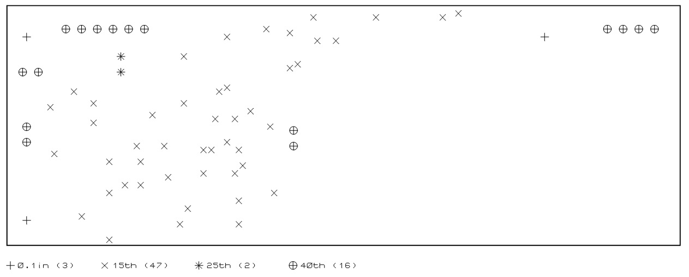

# Меню Output

<strong>Print…</strong> – осуществляет печать проекта с помощью обычного принтера в Windows и множеством предварительных настроек (Рис. 6).

Рис. 6

При первом вызове команды выводится сообщение (Рис. 7) информирующее о том, что дополнительные настройки в окне предварительного просмотра можно вызвать щелчком правой кнопки мыши. Это сообщение не будет больше выдаваться, если выбрать флажок Don’t display this message again.

Рис. 7

Печать может быть отменена, нажатием на клавишу ESC, хотя может пройти некоторое время, прежде чем ARES и принтер/графопостроитель очистят свои буферы.

В верхней части диалогового окна – <strong>Printer</strong> – можно выбрать и настроить принтер, который будет использоваться для печати. Это же диалоговое окно выводится при выборе команды <strong>Printer Setup</strong>. В этом случае выбранные настройки принтера не сохраняются. Это можно использовать, если нужно напечатать определенный проект на принтере, отличном от используемого по умолчанию. Параметры в правом верхнем углу <strong>Options</strong> позволяют осуществить цветную печать (необходимо установить флажок <strong>Colour?</strong>), изменить цвета на противоположные (необходимо установить флажок <strong>Invert Colours?</strong>), например при распечатке негативов и использовать драйвер для графопостроителя (плоттера) от Labcenter (необходимо установить флажок <strong>Labcenter Plotter Driver?</strong>). Эта функция может использоваться, если в качестве устройства вывода выбран графопостроитель.

Ниже в выпадающем списке можно выбрать один из режимов печати – <strong>Mode</strong>:

<ul>
<li><strong>Artwork</strong> – в этом режиме выводится обычный рисунок печатной платы с контактными площадками, дорожками и графикой, изображенный с указанными размерами. Толщина графических линий шелкографии настраивается через команду <strong>Set Templates</strong>.</li>
<li><strong>Resist</strong> – в этом режиме создается негатив для защитной паяльной маски, на котором изображаются контактные площадки без меток позволяющих отцентрировать сверло и увеличенные на величину Guard Gap (защитного зазора), связанную с каждым стилем контактной площадки и переходного отверстия. Если защитная маска должна покрывать переходные отверстия, то выберите значение Guard Gap для стиля переходных отверстий равное –1. Дорожки и шелкография не изображаются в этом режиме.</li>
<li><strong>Mask</strong> – в этом режиме создается негатив паяльной маски для элементов с поверхностным монтажом, изображая только контактные площадки поверхностного монтажа текущего размера. Обычно создаются изображения паяльных масок для слоев Top Copper и Bottom Copper.</li>
<li><strong>Drill</strong> – в этом режиме создается особое изображение, где каждое отверстие для сверления с разным диаметром обозначается различным символом (Рис. 8). По умолчанию создаются до 15 таких символов с названиями от $DR00 до $DR14. Если необходимо создать печатную плату, на которой существует более 15 отверстий с разным диаметром, то дополнительные отверстия ARES изобразит в виде окружностей с диаметром равным диаметру отверстия.</li>
</ul>

Рис. 8

Раздел <strong>Layers/Artworks</strong> позволяет выбирать слои для распечатки:

<code style="color: #FFF; background-color: rgb(204,0,0);">Top Copper</code> – верхний медный слой печатной платы.

<code style="color: #FFF; background-color: rgb(0,0,204);">Bottom Copper</code> – нижний медный слой печатной платы.

<code style="color: #000; background-color: rgb(0,255,255);">Top Silk</code> – слой для нанесения шелкографии на верхней стороне платы.

<code style="color: #000; background-color: rgb(255,0,255);">Bottom Silk</code> – слой для нанесения шелкографии на нижней стороне платы.

<code style="color: #000; background-color: rgb(0,204,0);">Top Resist</code> – слой паяльной маски на верхней стороне платы.

<code style="color: #000; background-color: rgb(0,204,0);">Bottom Resist</code> – слой паяльной маски на нижней стороне платы.

<code style="color: #000; background-color: rgb(204,204,0);">Top Mask</code> – слой паяльной пасты на верхней стороне платы.

<code style="color: #000; background-color: rgb(204,204,0);">Bottom Mask</code> – слой паяльной пасты на нижней стороне платы.

<code style="color: #FFF; background-color: rgb(134,134,134);">Drill</code> – слой, содержащий информацию о характеристиках отверстий в печатной плате.

<code style="color: #000; background-color: rgb(255,255,0);">Board Edge</code> – слой, определяющий границы печатной платы.

<code style="color: #FFF; background-color: rgb(204,102,51);">Inner 1 … Inner 14</code> – внутренние слои печатной платы, которые могут использоваться для прокладки электрических соединений.

<code style="color: #FFF; background-color: rgb(192,192,192);">Mech. 1 … Mech. 4</code> – механические слои для создания пазов и других нестандартных рисунков на печатной плате. Смотри также раздел «Механические операции, производимые с платой. Вырезание пазов».

Кнопка <strong>All</strong> позволяет выбрать все слои, а <strong>None</strong> – снимает выделение со всех слоев.

Раздел <strong>Scale</strong> определяет масштаб печатаемого изображения: 50% (уменьшение в 2 раза), 100% (стандартный), 150% (увеличение в 1,5 раза), 200% (увеличение в 2 раза), 400% (увеличение в 4 раза), 500% (увеличение в 5 раз).

Установленный флажок <strong>Separate Pages?</strong> позволяет распечатывать каждый слой, выбранный в разделе <strong>Layers/Artworks</strong> на отдельном листе. Если флажок не установлен все выбранные слои накладываются друг на друга и печатаются на одном листе.

Параметр <strong>Copies</strong> определяет количество копий при печати.

<strong>Раздел Rotation</strong> определяет ориентацию изображения относительно страницы:

<strong>X Horizontal</strong> – ось X параллельна краю листа меньшему по размеру и направлена вправо.

<strong>X Vertical</strong> – ось X параллельна краю листа большему по размеру и направлена вверх.

<strong>Раздел Reflection</strong> определяет как будет выводиться изображение: как оно изображено на экране (<strong>Normal</strong>) или отраженное относительно оси Y (<strong>Mirror</strong>).

Корректирующие коэффициенты – <strong>Compensation Factors</strong> – масштабируют абсолютные координаты графики, не изменяя относительных размеров. Например, если существует линия длиной 10 условных единиц с началом в координатах (5, 5) и установлены корректирующие коэффициенты X = 0,6 и Y = 0,5, то линия будет выводиться в точке с координатами (3, 2), но её длина (10 условных единиц) не изменится. Эти коэффициенты можно использовать при печати изображений, для которых критически важным является сохранение относительного размера графики. Коэффициенты могут изменяться в пределах от 0,01 до 100.

Установленный флажок напротив пути в разделе <strong>Print to File?</strong> позволяет распечатать изображение в файл, а также выбрать путь и название файла (с помощью кнопки <strong>Filename</strong>).

Меню <strong>Advanced Option</strong> позволяет всегда использовать цветные настройки для принтера (<strong>Always Enable Color Options</strong>) и всегда использовать драйвер для графопостроителя Labcenter (<strong>Always Enable Labcenter Plotter Support</strong>).

В правой части диалогового окна Print показано окно предварительного просмотра и отображается положение и размер печатной платы относительно указанного размера листа бумаги. Он будет обновляться в реальном времени  в зависимости от выбранных настроек (масштаба, цвета и т. д.).

Пользователь может настроить положение платы, зажав левую кнопку мыши на окне предварительного просмотра и перетащив плату в требуемое место на области печати. Также можно выбрать одно из стандартных положений, нажав правую кнопку мыши на окне предварительного просмотра и выбрать желаемое положение из контекстного меню:

<ol>
<li><strong>Position Output at Top</strong> – выровнять печатаемое изображение по верхнему краю;</li>
<li><strong>Position Output at Bottom</strong> – выровнять печатаемое изображение по нижнему краю;</li>
<li><strong>Position Output at Left</strong> – выровнять печатаемое изображение по левому краю;</li>
<li><strong>Position Output at Right</strong> – выровнять печатаемое изображение по правому краю;</li>
<li><strong>Position Output at Center</strong> – выровнять печатаемое изображение по центру;</li>
<li><strong>Position Output Numerically…</strong> – позволяет задать отступы сверху, снизу, слева и справа от печатаемого изображения;</li>
<li><strong>Use Printer Margins?</strong> – использовать поля принтера или нет.</li>
</ol>

Пользователь может вручную настроить положение печатной платы в пределах области печати, нажав правую кнопку мыши в окне предварительного просмотра и выбрав <strong>Position Output Numerically…</strong> и введя отступ между границей области печати и границей печатной платы. Это абсолютный метод позиционирования печатной платы в пределах области печати. В общем случае большинству пользователей будет проще задавать положение печатной платы, перетаскивая плату с помощью мыши.

Если снять флажок <strong>Use Printer Margins?</strong> в контекстном меню, то отступы, которые определил пользователь, будут отсчитываться от границы самой бумаги, а не области печати (Рис. 9). В большинстве случаев это делать не рекомендуется поскольку, в зависимости от модели принтера, можно потерять часть печатаемого изображения, если расположить его у края бумаги (вне области печати).

Рис. 9

1 – размер бумаги, 2 – область печати, 3 – печатаемое изображение, 4 – отступы.

<strong>Printer setup…</strong> – позволяет выбрать и настроить принтер для печати. Команда запускает стандартное диалоговое окно Windows для выбора и конфигурации принтера. Таким образом, настройки зависят от конкретной версии Windows и используемого принтера. Все настройки печати, включая печатающее устройство, запоминаются ARES и это печатающее устройство будет выбрано по умолчанию при последующих запусках ARES.

<strong>Printer Information</strong> – выдает протокол о характеристиках принтера и его возможностях. Он служит в основном в качестве вспомогательной информации. Эту информацию можно скопировать в буфер обмена (кнопка <strong>Clipboard</strong>), сохранить в текстовый файл (кнопка <strong>Save as</strong>) или закрыть без сохранения (кнопка <strong>Close</strong>).

<strong>Set Output Area</strong> – позволяет выбрать область для печати. По умолчанию этой областью является граница печатной платы.

<strong>Set Output Origin</strong> – позволяет выбрать глобальное начало координат.

Для систем автоматизированного проектирования/производства, а также при создании платы, которая должна помещаться в заранее изготовленный корпус, бывает необходимо определить точку, с которой связана система координат. В ARES эта точка называется глобальным началом координат и отображается в виде синей окружности с перекрестием в основном окне редактирования. Задача команды заключается в переносе глобального начала координат в текущие координаты курсора мыши, что используется, например, при создании сложных посадочных мест.

<strong>Export Graphics...</strong> – кроме непосредственной печати с помощью печатающих устройств, ARES для Windows может создавать файлы, используемые в других графических приложениях. Пользователь может выбрать в качестве выходного формата Bitmap, Windows Metafile, DXF, EPS, PDF, Vector File (векторный формат файла) или Overlay. Пользователь может передать изображение в другие приложения через буфер обмена или сохранить его в файл на диск.

Export Bitmap… – создает побитовое (растровое) изображение печатной платы и помещает его или в буфер обмена или в файл на диск (Рис. 10).

Рис. 10

В диалоговом окне можно выбрать один из режимов печати – Mode:

<ul>
<li>Artwork – в этом режиме выводится обычный рисунок печатной платы с контактными площадками, дорожками и графикой, изображенный с указанными размерами. Толщина графических линий шелкографии настраивается через команду Set Templates.</li>
<li>Solder Resist – в этом режиме создается негатив для защитной паяльной маски, на котором изображаются контактные площадки без меток позволяющих отцентрировать сверло и увеличенные на величину Guard Gap (защитного зазора), связанную с каждым стилем контактной площадки и переходного отверстия. Если защитная маска должна покрывать переходные отверстия, то выберите значение Guard Gap для стиля переходных отверстий равное –1. Дорожки и шелкография не изображаются в этом режиме.</li>
<li>SMT Mask – в этом режиме создается негатив паяльной маски для элементов с поверхностным монтажом, изображая только контактные площадки поверхностного монтажа текущего размера. Обычно создаются изображения паяльных масок для слоев <code style="color: #FFF; background-color: rgb(204,0,0);">Top Copper</code> и <code style="color: #FFF; background-color: rgb(0,0,204);">Bottom Copper</code>.</li>
<li>Drill Plot – в этом режиме создается особое изображение, где каждое отверстие для сверления с разным диаметром обозначается различным символом (Рис. 8). По умолчанию создаются до 15 таких символов с названиями от $DR00 до $DR14. Если необходимо создать печатную плату, на которой существует более 15 отверстий с разным диаметром, то дополнительные отверстия ARES изобразит в виде окружностей с диаметром равным диаметру отверстия.</li>
</ul>

Раздел Layers позволяет выбирать слои для распечатки:

<code style="color: #FFF; background-color: rgb(204,0,0);">Top Copper</code> – верхний медный слой печатной платы.

<code style="color: #FFF; background-color: rgb(0,0,204);">Bottom Copper</code> – нижний медный слой печатной платы.

<code style="color: #000; background-color: rgb(0,255,255);">Top Silk</code> – слой для нанесения шелкографии на верхней стороне платы.

<code style="color: #000; background-color: rgb(255,0,255);">Bottom Silk</code> – слой для нанесения шелкографии на нижней стороне платы.

<code style="color: #000; background-color: rgb(255,255,0);">Board Edge</code> – слой, определяющий границы печатной платы.

<code style="color: #FFF; background-color: rgb(204,102,51);">Inner 1 … Inner 14</code> – внутренние слои печатной платы, которые могут использоваться для прокладки электрических соединений.

<code style="color: #FFF; background-color: rgb(192,192,192);">Mech. 1 … Mech. 4</code> – механические слои для создания пазов и других нестандартных рисунков на печатной плате. Смотри также раздел «Механические операции, производимые с платой. Вырезание пазов».

Кнопка <strong>All</strong> позволяет выбрать все слои, а <strong>None</strong> – снимает выделение со всех слоев.

Раздел <strong>Resolution</strong> позволяет выбрать разрешающую способность, которая будет использоваться для создания изображения в диапазоне от 100 до 600 DPI (точек на дюйм). Использование памяти возрастает пропорционально квадрату разрешающей способности, поэтому побитовое изображение с разрешением 600 DPI требует в 36 раз больше памяти, чем изображение с разрешением 100 DPI. Побитовое изображение с разрешением 100 DPI в 256 цветов требует 10 кбайт на квадратный дюйм (5 кБ при использовании 16 цветов).

Раздел <strong>Colour</strong> позволяет выбрать цвет, используемый при создании изображения:

<ul>
<li><strong>Mono</strong> – черно-белое изображение;</li>
<li><strong>16</strong> – изображение, использующее цветовую гамму из 16 цветов;</li>
<li><strong>256</strong> – изображение, использующее цветовую гамму из 16 цветов;</li>
<li><strong>Display</strong> – изображение, использующее цветовую гамму, аналогичную той, которая используется для вывода изображения на экран.
</li>
</ul>

Установленный флажок <strong>Invert?</strong> позволяет изменить используемые цвета на противоположные.

Раздел <strong>Rotation</strong> определяет ориентацию изображения относительно экрана:

<ul>
<li><strong>X Horizontal</strong> – ось X параллельна горизонтали и направлена вправо.</li>
<li><strong>X Vertical</strong> – ось X параллельна вертикали и направлена вверх.</li>
</ul>

Раздел <strong>Reflection</strong> определяет как будет выводиться изображение: как оно изображено на экране (<strong>Normal</strong>) или отраженное относительно оси Y (<strong>Mirror</strong>).

Корректирующие коэффициенты – <strong>Compensation</strong> – масштабируют абсолютные координаты графики, не изменяя относительных размеров. Например, если существует линия длиной 10 условных единиц с началом в координатах (5, 5) и установлены корректирующие коэффициенты X = 0,6 и Y = 0,5, то линия будет выводиться в точке с координатами (3, 2), но её длина (10 условных единиц) не изменится. Эти коэффициенты можно использовать при печати изображений, для которых критически важным является сохранение относительного размера графики. Коэффициенты могут изменяться в пределах от 0,01 до 100.

Установленный флажок напротив пути в разделе <strong>Output to File?</strong> позволяет вывести изображение в файл, а также выбрать путь и название файла (с помощью кнопки <strong>Filename</strong>). Если флажок не установлен, изображение после нажатия на кнопку OK копируется в буфер обмена.

<strong>Export Metafile…</strong> – создает метафайл печатной платы и помещает его или в буфер обмена или в файл на диске (Рис. 11). Преимущество формата Windows Metafile (формат векторной графики) заключается в сохранении качества картинки при масштабировании в отличие от побитового изображения. Однако, не все приложения Windows могут открыть Metafile (например, Paint).

Рис. 11

Раздел <strong>Options</strong> содержит несколько переключателей, позволяющих выбрать:

<ul>
<li>установленный флажок <strong>Colour Output?</strong> позволяет создать цветной метафайл; в противном случае создается черно-белый файл;</li>
<li>установленный флажок <strong>Invert Colours?</strong> позволяет изменить используемые цвета на противоположные;</li>
<li>установленный флажок <strong>Erase Background?</strong> приводит к созданию черного фонового прямоугольника перед изображением основного рисунка; в противном случае создаваемое изображение имеет прозрачный фон.</li>
</ul>

Остальные настройки аналогичны настройкам, используемым в команде <strong>Export Bitmap…</strong>

<strong>Export DXF</strong> – создает DXF файл печатной платы и помещает его на диск (Рис. 12). Формат DXF используется для преобразования выходного изображения в механические САПР приложения DOS (для передачи данных в программы САПР для Windows лучше использовать метафайл).

Рис. 12

Раздел <strong>Scale</strong> определяет масштаб выводимого в файл изображения: 50% (уменьшение в 2 раза), 100% (стандартный), 150% (увеличение в 1,5 раза), 200% (увеличение в 2 раза), 400% (увеличение в 4 раза).

Остальные настройки аналогичны настройкам, используемым в команде <strong>Export Bitmap…</strong>

<strong>Export EPS...</strong> – создает EPS файл печатной платы и помещает его на диск (Рис. 13). Файл EPS – это файл, использующий язык Postscript, который может быть встроен в другой документ. Хотя он часто используется в компьютерной верстке, для компьютерной верстки в операционной системе Windows лучше преобразовывать графику, используя метафайл, скопированный в буфер обмена.

Рис. 13

Настройки на рис. 13 аналогичны настройкам, используемым в команде <strong>Export DXF…</strong>

<strong>Export PDF…</strong> – создает PDF файл печатной платы и помещает его на диск (Рис. 14).

Рис. 14

Раздел <strong>Options</strong> содержит несколько переключателей, позволяющих выбрать:

<ul>
<li>установленный флажок <strong>Colour Output?</strong> позволяет создать цветной PDF-файл; в противном случае создается черно-белый файл;</li>
<li>установленный флажок <strong>Invert Colours?</strong> позволяет изменить используемые цвета на противоположные;</li>
<li>установленный флажок <strong>Erase Background?</strong> приводит к созданию черного фонового прямоугольника перед изображением основного рисунка; в противном случае создаваемое изображение имеет прозрачный фон.</li>
<li>установленный флажок <strong>Separate Pages?</strong> позволяет изобразить каждый слой, выбранный в разделе Layers на отдельном листе PDF-файла.</li>
<li>при установленном флажке <strong>Launch Acrobat?</strong> запускается программа Acrobat Reader, позволяющая просмотреть PDF-файл после его создания.</li>
</li>
</ul>

Остальные настройки аналогичны настройкам, используемым в команде <strong>Export Bitmap…</strong>

<strong>Export Vector File...</strong> – создает векторный файл печатной платы и помещает его на диск (Рис. 15).

Рис. 15

В разделе <strong>Device</strong> можно выбрать векторный формат для экспорта:

<ul>
<li>начало координат файл стандарта HPGL находится в верхнем левом углу;</li>
<li>начало координат файл стандарта HPGL (CTO) находится в центре изображения;</li>
<li>файл формата Hi-80 совместим с большинством графопостроителей Epson;</li>
<li>файл формата DPML совместим с большинством графопостроителей Houston.</li>
</ul>

Остальные настройки аналогичны настройкам, используемым в команде <strong>Export DXF…</strong>

<strong>Export Overlay…</strong> – создает изображение наложенных друг на друга слоев и помещает их в виде побитового изображения в буфер обмена или в файл на диск (Рис. 16). Наложенное изображение создается сначала осветлением медных слоев, а затем наложением одного или нескольких слоев шелкографии сверху них. Полученное изображение позволяет показать местоположения компонентов на плате так, чтобы их было лучше видно на фоне дорожек.

Рис. 16

Раздел <strong>Copper Layers</strong> позволяет выбрать медные слои для наложения:

<code style="color: #FFF; background-color: rgb(204,0,0);">Top</code> – верхний медный слой печатной платы.

<code style="color: #FFF; background-color: rgb(0,0,204);">Bottom</code> – нижний медный слой печатной платы.

<code style="color: #FFF; background-color: rgb(204,102,51);">Inner 1 … Inner 14</code> – внутренние слои печатной платы, которые могут использоваться для прокладки электрических соединений.

Раздел <strong>Silk Screens</strong> позволяет выбрать слои шелкографии для наложения:

<code style="color: #000; background-color: rgb(0,255,255);">Top Silk</code> – слой для нанесения шелкографии на верхней стороне платы.

<code style="color: #000; background-color: rgb(255,0,255);">Bottom Silk</code> – слой для нанесения шелкографии на нижней стороне платы.

<code style="color: #FFF; background-color: rgb(192,192,192);">M1 … M4</code> – механические слои для создания пазов и других нестандартных рисунков на печатной плате.

Установленный флажок <strong>Heavy?</strong> приводит к тому, что медные слои осветляются на 75% вместо стандартных 50%.

Остальные настройки аналогичны настройкам, используемым в команде <strong>Export Bitmap…</strong>

<strong>Pre Production Check</strong> – запускает предварительную проверку перед производством печатной платы (Рис. 17).

Рис. 17

Предварительная проверка перед производством – это автоматический тест печатной платы на часто встречающиеся ошибки, который обычно запускается перед отправкой печатной платы на производство. Рекомендуется устранить любые ошибки, о которых сообщается после запуска этой проверки перед производством печатной платы.

Предварительная проверка перед производством – это вспомогательный инструмент, а не замена ручной проверки печатной платы и соответствия требованиям проекта. Ответственность на соответствие техническому заданию всегда лежит на проектировщике платы, поэтому рекомендуется всегда создавать и тестировать физический макет до массового производства платы.

Ниже приведен список осуществляемых проверок и последовательность действий при возникновении ошибок:

<ol>
<li>Проверка соединений. Этот тест автоматически запускает CRC, проверяет и распознает были ли осуществлены все соединения, указанные в списке соединений. Если тест завершается с ошибкой, необходимо запустить Connectivity Checker… из меню Tools и дважды щелкнуть на ошибке, чтобы увидеть отсутствующие соединения на печатной плате.</li>
<li>Проверка правильности объектов. Этот тест проверяет целостность объектов на печатной плате и всегда должен завершаться успешно. Если тест завершается с ошибкой необходимо обратиться в службу поддержки Labcenter.</li>
<li>Проверка DRC. Этот тест повторно запускает проверку правил проектирования для печатной платы. Если проверка правил проектирования отключена, её необходимо включить из Design Rule Manager в меню Tools. Если существуют ошибки правил проектирования, то их можно просмотреть, нажав на отчете о DRC ошибках на панели задач в нижней правой части приложения. Ошибки выделяются и отображаются в центре экрана, если дважды щелкнуть на них левой кнопкой мыши в открывшемся диалоговом окне. Правила проектирования настраиваются через Design Rule Manager из меню Tools. Необходимо устранить все DRC ошибки перед производством платы. Для этого настройте соответствующие правила проектирования для печатной платы (если это не было сделано раньше), изменить разводку так, чтобы она соответствовала определенным правилам проектирования или намеренно проигнорируйте ошибку, нажав на ней правой кнопкой и выбрав ‘Ignore this Error’ из выпадающего контекстного меню.</li>
<li>Проверка пересечения областей металлизации. Этот тест проверяет все области металлизации на их пересечение. Он использует абсолютно другой алгоритм, отличающийся от кода для размещения области металлизации в общем случае, и таким образом является дополнительным средством проверки правильности их создания. Если тест завершается с ошибкой необходимо обратиться в службу поддержки Labcenter.</li>
<li>Проверка на неразмещенные компоненты. Этот тест просто проверяет размещены ли все компоненты, приведенные в списке соединений на плате. Если тест завершается с ошибкой, то необходимо разместить недостающие компоненты или изменить принципиальную схему и перезагрузить список соединений, если они избыточны.</li>
<li>Проверка границ платы. Этот тест проверяет наличие границ платы и её замкнутость (отсутствие разрывов). Если тест завершается с ошибкой, то нужно заново поместить границу печатной платы или отредактировать существующую, чтобы она была замкнутой. Сложные границы печатной платы необходимо всегда изображать с помощью инструмента 2D Graphics Path, поскольку это гарантирует замкнутость границ печатной платы. Криволинейные участки можно нарисовать, удерживая клавишу CTRL при размещении участка. Отредактировать криволинейные участки можно с помощью маркеров, расположенных вдоль него.</li>
<li>Проверка компонентов, расположенных за пределами границ платы. Этот тест проверяет расположены ли все компоненты внутри границ платы и нет ли забытых компонентов, находящихся за её пределами. Если тест завершается с ошибкой, то необходимо заново развести плату так, чтобы все компоненты находились внутри её границ.</li>
<li>Проверка правильности переходных отверстий. Этот тест проверяет правильность и непрерывность переходов между слоями переходных отверстий на печатной плате. Если тест завершается с ошибкой, то необходимо отредактировать стили переходных отверстий и проверить пары слоев.</li>
</ol>

Manufacturing notes… – открывает диалоговое окно, позволяющее добавить специфические указания, касающиеся производства платы к сопроводительной инструкции, генерируемой с файлом, используемым для производства печатных плат. В нижней части диалогового окна в выпадающем списке можно добавить комментарии, касающиеся разводки печатной платы (Layout Notes) или непосредственно её производства (CADCAM Notes).

Gerber/Excellon Output… – открывает диалоговое окно, позволяющее сохранить печатную плату в формате Gerber и Excellon (Рис. 18). Перед появлением диалогового окна возможно также появление сообщения, сигнализирующего об изменениях возникших с момента последней предварительную проверки и предлагающее осуществить предварительную проверку печатной платы до создания файлов для производства (Рис. 19). Нажатие на кнопку Yes запустит проверку, а No – сразу откроет диалоговое окно (Рис. 18).

Рис. 18

Рис. 19

Формат Gerber, названный в честь корпорации Gerber Scientific Instruments, – это практически универсальный формат при производстве печатной платы для сохранения рисунка печатной платы, хотя он может быть постепенно заменен форматом Postscript.

Фотографопостроитель по существу аналогичен перьевому графопостроителю, за исключением того, что в нем печать осуществляется световым лучом на фоточувствительной пленке, а не чернильным пером по бумаге. Отверстие, через которое светит луч, может меняться, что позволяет создавать контактную площадку с помощью одного светового луча, а дорожку одним движением световой головки.

Для создания фотоизображения сначала необходимо настроить фотографопостроитель, задав набор отверстий, соответствующий различным формам контактных площадок и толщин дорожек, используемых на плате. Каждое различное отверстие определяется так называемым D-кодом в Gerber файле, поэтому необходимо составить таблицу, в которой указаны D-коды и форма и размеры отверстий. Эта таблица создается автоматически и записывается в виде части информационного файла для графопостроителя.

ARES определяет, когда две контактных площадки имеют одинаковые отверстия и будет использовать только один D-код в этом случае. Также стили, которые присутствуют в селекторе объектов, но не используются на плате, в таблицу не попадают, чтобы не занимать лишнего места.

Необходимо также помнить, что:

<ul>
<li>Фотографопостроитель не может обработать изображение контактной площадки с отверстием в центре, поэтому они используются только для работы с платами для поверхностного монтажа и платы, созданные с помощью них очень сложно сверлить вручную.</li>
<li>Прямоугольные контактные площадки, которые повернуты на не ортогональные углы, создаются, используя штриховку отрезками.</li>
<li>Сплошные многоугольные заземляющие площадки изображаются штриховкой, поэтому получившиеся выходные файлы могут быть большими. Однако, границы будут изображены точно – используя отверстия для луча, соответствующие толщине границы области металлизации, поэтому не происходит нарушений правил проектирования.</li>
<li>Начало координат системы координат Gerber определяется командой Set Output Origin из меню Output.</li>
</ul>

Многие производители печатных плат имеют станки с ЧПУ, которые, используя информацию о местоположении и размерах каждой контактной площадки, могут автоматически создать печатную плату. Почти все эти станки используют формат Excellon, созданный Excellon Industries.

Формат очень простой и состоит из местоположений (x, y) отверстий и T-кодов, определяющих какое сверло использовать. Как и для формата Gerber, создается таблица с информационным файлом для станка, в которой приведен в виде списка диаметр отверстия, соответствующий каждому T-коду. ARES создает её таким же образом, как и каждый Gerber D-код – он назначает новый T-код каждому новому размеру отверстия и эта информация заносится в информационный файл.

ARES также встраивает информацию о размере сверл в файл Excellon; этого достаточно, если пользователь не создает плату со сложными требованиями по сверлению, такими как глухие/внутренние переходные отверстия или сквозные и несквозные отверстия.

ARES использует одинаковые системы координат для файлов Gerber и Excellon – основанные на положении выходного начала координат Output Origin, поэтому производитель не должен иметь проблем при выставке станка.

Размеры используемых свёрл, берутся из свойства Drill Hole стиля контактной площадки.

Вкладка CADCAM Output разбита на несколько разделов.

В разделе Output Generation можно указать:

<ul>
<li>в полях Filestem и Folder – общую часть в названии для всех создаваемых файлов и каталог, в котором они будут храниться. По умолчанию это название и каталог, в которой находится файл печатной платы, но его можно изменить на, например, C:\GERBER\MYBOARD так, чтобы все созданные файлы сохранялись в этом каталоге. Пользователь может определить каталог по умолчанию для файлов, используемых для производства печатных плат, через команду Set Paths в меню System.</li>
<li>Установленный переключатель Output to individual TXT files? позволяет экспортировать всю информацию в виде отдельных TXT файлов в выбранном каталоге, а переключатель Output to a single ZIP file? – в один zip-архив в выбранном каталоге. В зависимости от выбора пользователя, он может затем установить флажки для автоматического запуска проводника Windows (Automatically open output folder) или zip-архиватора (Automatically open ZIP file?), чтобы просмотреть созданные файлы.</li>
</ul>

В разделе Layers/Artworks можно указать какие слои нужно помещать в файлы для текущего проекта. Некоторые слои выделяются автоматически, используя информацию о том, что содержится на плате.

<code style="color: #FFF; background-color: rgb(204,0,0);">Top Copper</code> – верхний медный слой печатной платы.

<code style="color: #FFF; background-color: rgb(0,0,204);">Bottom Copper</code> – нижний медный слой печатной платы.

<code style="color: #000; background-color: rgb(0,255,255);">Top Silk</code> – слой для нанесения шелкографии на верхней стороне платы.

<code style="color: #000; background-color: rgb(255,0,255);">Bottom Silk</code> – слой для нанесения шелкографии на нижней стороне платы.

<code style="color: #000; background-color: rgb(0,204,0);">Top Resist</code> – слой паяльной маски на верхней стороне платы.

<code style="color: #000; background-color: rgb(0,204,0);">Bottom Resist</code> – слой паяльной маски на нижней стороне платы.

<code style="color: #000; background-color: rgb(204,204,0);">Top Mask</code> – слой паяльной пасты на верхней стороне платы.

<code style="color: #000; background-color: rgb(204,204,0);">Bottom Mask</code> – слой паяльной пасты на нижней стороне платы.

<code style="color: #FFF; background-color: rgb(134,134,134);">Drill</code> – слой, содержащий информацию о характеристиках отверстий в печатной плате.

<code style="color: #000; background-color: rgb(255,255,0);">Board Edge</code> – слой, определяющий границы печатной платы.

<code style="color: #FFF; background-color: rgb(204,102,51);">Inner 1 … Inner 14</code> – внутренние слои печатной платы, которые могут использоваться для прокладки электрических соединений.

<code style="color: #FFF; background-color: rgb(192,192,192);">Mech. 1 … Mech. 4</code> – механические слои для создания пазов и других нестандартных рисунков на печатной плате. Смотри также раздел «Механические операции, производимые с платой. Вырезание пазов».

Установленный флажок Apply Global Guard Gap позволяет использовать глобальный защитный зазор для контактных площадок и переходных отверстий на слоях Top Resist и Bottom Resist, а также задавать величину зазора. Это настройка влияет на все контактные площадки и переходные отверстия, за исключением тех, которые были изменены вручную на плате.

Кнопка All позволяет выбрать все слои, а None – снимает выделение со всех слоев.

Раздел Rotation определяет ориентацию изображения относительно экрана:

<ul>
<li>X Horizontal – ось X параллельна горизонтали и направлена вправо.</li>
<li>X Vertical – ось X параллельна вертикали и направлена вверх.</li>
</ul>

Раздел Reflection определяет как будет выводиться изображение: как оно изображено на экране (Normal) или отраженное относительно оси Y (Mirror).

Раздел INF File Units позволяет указать единицу измерения для всех отверстий: дюймовые – милы (Imperial (thou)), метрические – мм (Metric (mm)) или выбираемые автоматически (Auto), на основе информации содержащейся в плате.

Раздел Gerber Format позволяет использовать новый RS274X или старый RS274D формат Gerber. Главное преимущество RS274X заключается в том, что информация об отверстиях встроена в файлы и её не нужно вводить вручную.

Раздел Slotting/Routing Layer позволяет выбрать из выпадающего списка какие слои использовать для определения двумерной графики, применяемой для создания пазов и других элементов на плате.

Раздел Bitmap/Font Rasterizer управляет разрешающей способностью (125 dpi, 250 dpi, 500 pdi или 1000 dpi), которая используется для создания побитовых изображений шрифтов, областей металлизации и других объектов. Чем больше разрешающая способность, чем лучше качество получившихся изображений, но больше размер файлов. В общем случае обычно можно использовать значения по умолчанию.

Установленный флажок в нижней левой части Run Gerber Viewer When Done? позволяет автоматически загрузить выходной файл в Labcenter просмотрщик файлов Gerber, например, если необходимо проверить набор файлов перед отправкой производителю.

Вкладка CADCAM Notes содержит три поля:

<ul>
<li>Notes позволяет добавить любую важную информацию или особые требования для производителя, например, указать слой для прорезки пазов. Они сохраняются автоматически в READ-ME файле проекта.</li>
<li>Contact Details позволяет добавить контактную информацию, например, для связи производителя с заказчиком. Они сохраняются автоматически в READ-ME файле проекта.</li>
<li>ZIP File Comment позволяет добавить комментарии для zip-файла, который появляются по умолчанию, когда пользователь (или производитель печатной платы) открывает zip-архив. Его можно использовать в качестве «цифровой подписи» своих архивов или для указания специальных инструкций и т. д. производителю платы.</li>
</ul>

READ-ME файл также содержит список всех создаваемых файлов и настройки для фотографопостроителя и сверлильного станка с ЧПУ.

Любые файлы, создаваемые при предыдущем запуске команды, но теперь соответствующие отключенному слою, удаляются.

<strong>Gerber View…</strong> – позволяет загрузить и отобразить файлы, созданные командой Gerber/Excellon Output...

Чтобы просмотреть файл Gerber/Excellon, необходимо:

<ol>
<li>Вызвать команду <strong>Gerber View…</strong> из меню <strong>Output</strong>. Если вы изменили, но не сохранили текущий проект, программа предложит сделать это, поскольку несохраненные данные текущего проекта потеряются после чтения Gerber файла.</li>
<li>Выбрать файл READ-ME.txt из проводника. <strong>Gerber View…</strong> может считывать только Gerber файлы, созданные ARES, для которых существует файл READ-ME.txt.</li>
<li>ARES проанализирует файл и отобразит диалоговое окно для выбора слоев, которые необходимо просмотреть. По умолчанию загружаются все доступные слои.</li>
</ol>

Хотя можно осуществлять операции редактирования в просмотрщике Gerber файлов, использовать эти операции не рекомендуется, кроме мультиплицирования печатных плат.

<strong>Pick and Place File…</strong> – создает и сохраняет файл, который используется в качестве начальной настройки машин для автоматической установки компонентов на плату. По существу в этом файле представлены слои, местоположения и поворот компонентов в стандартном текстовом формате для представления табличных данных.

Пример такого файла показан ниже:

LABCENTER PROTEUS PICK AND PLACE FILE

=====================================
 

Component positions for K:\Prodev\Ares\ppsu.LYT

Fields: Part ID, Value, Package, Layer, Rotation, X, Y

Units:  Rotation - degrees, X, Y  - thou

Notes:  The X, Y value is the centre of package as drawn in ARES.

The origin for these values is the Output Origin.

The values are a guide only and must be checked manually when

setting up automatic insertion equipment.

 

"U1","","DIL08",TOP,0,6000,5000

"Q1","","TO220",TOP,180,6050,5375

"D1","","DIODE30",TOP,180,6050,5250

"R1","","RES40",TOP,270,6300,5050

"R2","","RES40",TOP,270,6400,5050

"Q2","","TO92",TOP,90,5650,5050

"R3","","RES40",TOP,180,5800,4750

"C1","","CAP10",TOP,180,6200,4750

"C2","","CAP10",TOP,0,5650,5350

В этом файле:

<ul>
<li>Начало координат – это <strong>Output Origin</strong> – то же начало координат, которое используется для форматов Gerber/Excellon.</li>
<li>Координаты (x,y) рассчитываются в милах и представляют центр корпуса компонента. Они позволяют примерно определить точку для ручной выставки головки, размещающей компоненты.</li>
<li>Поворот определяется в виде значений в градусах против часовой стрелки относительно ориентации корпуса, которая использовалась при его создании. Поскольку нет стандарта для ориентации корпусов по умолчанию, эти значения имеют ограниченное использование, если их не объединить с таблицей преобразования, содержащей информацию о начальной ориентации корпусов ARES, включая те, которые определены пользователем.</li>
</ul>

<strong>Testpoint Information file…</strong> – создает и сохраняет информационный файл для проверки печатной платы по контрольным точкам.

Стандартный метод проверки плат с элементами и без элементов – использовать стенд с двумерной матрицей подпружиненных игольчатых контактов. Это устройство соединяет множество контактных площадок на стороне пайки платы и проверяет (с учетом списка соединений и другой информации) соединения между контрольными точками. Если существуют какие-либо отсутствующие элементы, короткие замыкания или плохо припаянные соединения, то стенд определит это и плата снимется с конвейера для исправления ошибок или отбраковки.

Чтобы настроить стенд для проверки, необходима информация о местоположении контактных площадок компонентов на стороне пайки платы и электрических цепях, которые они образуют. ARES создает особый файл, содержащий эту информацию.

LABCENTER PROTEUS TESTPOINT INFORMATION FILE

============================================

Testpoint positions for k:\prodev\ares\test.LYT
  

Fields: ID, Type, X, Y, Net

Units:  X, Y  - thou

Notes:  This file lists pads which are accessible from the bottom

The X, Y value is the centre of drill hole or pad origin.

 

"Q1:B","THRU",6150,5400,"#00000"

"Q1:C","THRU",6050,5400,"UNREG"

"Q1:E","THRU",5950,5400,"VOUT"

"D1:A","THRU",6200,5250,"VOUT"

"D1:K","THRU",5900,5250,"#00004"

"R1:1","SURF",6350,5250,"VOUT"

"R1:2","SURF",6350,4850,"#00001"

"R2:1","SURF",6450,5250,"#00001"

"R2:2","SURF",6450,4850,"GND=POWER"

"Q2:E","THRU",5650,4950,"GND=POWER"

"Q2:C","THRU",5650,5050,"#00004"

"Q2:B","THRU",5650,5150,"#00005"

"R3:1","THRU",6000,4750,"DIGITAL"

"R3:2","THRU",5600,4750,"#00005"

"C1:1","SURF",6250,4750,"ANALOG"

"C1:2","SURF",6150,4750,"GND=POWER"

"C2:1","SURF",5600,5350,"#00003"

"C2:2","SURF",5700,5350,"#00004"

"VIA","THRU",4650,4550,"#00003"

"VIA","THRU",4550,5700,"#00004"

В этом файле:

<ul>
<li>Контактные площадки определяются как &lt;PARTREF&gt;:&lt;PINNO&gt; (&lt;Компонент, к которому относится контактная площадка&gt;:&lt;номер вывода компонента&gt;) или "VIA" («ПЕРЕХОДНОЕ ОТВЕРСТИЕ»).</li>
<li>Контактные площадки имеют тип "THRU", если они сквозные или "SURF", если это площадки для поверхностного монтажа.</li>
<li>В списке приводятся только контактные площадки доступные со стороны пайки платы и которые не покрыты слоем защитной паяльной маски.</li>
<li>Координаты (x,y) приводятся в милах и представляют точку соединения контактной площадки. Это точка, к которой присоединяются дорожки в ARES.</li>
<li>Начало координат – это Output Origin – то же начало координат, которое используется для выходных форматов Gerber/Excellon.</li>
</ul>

<strong>ODB++ Output…</strong> – создает файл формата ODB++ (Рис. 20). Формат ODB++ был создан Valor Systems и объединяет информацию, содержащуюся в файлах Gerber/Excellon, файлах для автоматической установки компонентов и информационных файлах для проверки печатной платы в один набор файлов. База данных ODB++ также содержат высокоуровневое представление платы, используя компоненты, корпуса и списки соединений.

Рис. 20

