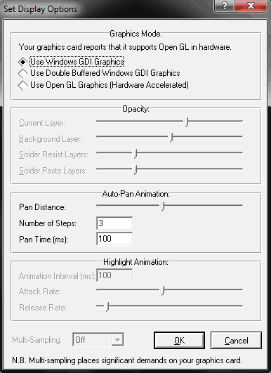
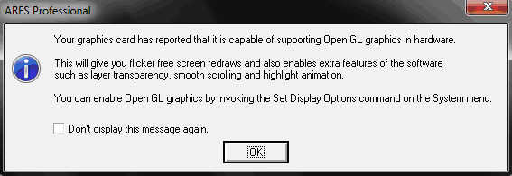

# Меню System

<strong>System Info…</strong> – выдает краткую информацию о версии Proteus, на кого зарегистрирована программа, свободной памяти и версии операционной системы.

<strong>Check for Updates…</strong> – проверка наличия обновлений на сайте.

<strong>Set Display Option…</strong> – настройка параметров отображения информации на экране (Рис. 63). ARES может использовать видеокарту компьютера для ускорения работы и прозрачного и сглаженного отображения слоёв на плате. Однако, поскольку не каждый компьютер обладает достаточно мощной видеокартой, программное обеспечение также может использовать средства Windows, для отображения информации и графических операций. Эти два режима работы называются:

<ul>
<li>Режим Windows GDI;</li>
<li>Режим аппаратного ускорения OpenGL.</li>
</ul>

При первом запуске ARES, программа посылает запрос видеокарте и выдаёт сообщение, показанное на Рис. 64, если компьютер может работать в режиме OpenGL.

Рис. 63

Рис. 64

Если видеокарта не достаточно мощная для поддержки аппаратного ускорения, то ARES использует выбранный по умолчанию режим Windows GDI. Многие из настроек на Рис. 63 доступны только в режиме OpenGL и будут отключены, если используется режим Windows GDI.

В верхней части диалогового окна (раздел <strong>Graphics Mode</strong>) определяется может ли видеокарта поддерживать аппаратное ускорение OpenGL и если да, то программа позволяет переключаться между режимом Windows GDI (<strong>Use Windows GDI Graphics</strong>), режимом Windows GDI c двойным буфером (более быстрый режим работы по сравнению с первым, но требующий больше памяти) (<strong>Use Double Buffered Windows GDI Graphics</strong>), режимом OpenGL (<strong>Use Open GL Graphics (Hardware Accelerated)</strong>). Если режим OpenGL недоступен, то в верхней части выводится сообщение о том, что видеокарта не поддерживает данный режим.

Если выбран режим OpenGL раздел <strong>Opacity</strong> позволяет настроить прозрачность различных слоёв печатной платы: <strong>Current Layer</strong> (Текущий выбранный слой), <strong>Background Layer</strong> (Фоновый слой), <strong>Solder Resist Layers</strong> (Слои защитной паяльной маски), <strong>Solder Paste Layers</strong> (Слои паяльной пасты).

В режиме OpenGL ARES особым образом обозначает текущий выбранный слой, делая его менее прозрачным, чем остальные медные слои на плате. Это означает, что объекты на слое, с которым происходит работа в данный момент, видны ярче, тогда как остальные слои видны тусклее. Разработчик может контролировать относительную прозрачность текущего слоя и фоновых слоя(ев), используя ползунки в этой части диалогового окна. Например, если нужно отключить прозрачность можно переместить ползунок фонового слоя в крайнее правое положение.

В режиме OpenGL можно также управлять прозрачностью слоя паяльной маски и пасты вокруг контактных площадок и переходных отверстий.

В ARES можно перемещаться по экрану, зажав клавишу Shift и передвигая курсор мыши в необходимый край основного окна редактирования. Подобным образом, перетаскивание объекта за край основного окна редактирования приведет к перемещению экрана в направлении перетаскивания. Скорость перемещения экрана регулируется в разделе, который называется <strong>Auto-Pan Animation</strong>.

Пользователь может настроить расстояние (<strong>Pan Distance</strong>), на которое перемещается экран, число шагов (<strong>Number of Steps</strong>), за которое происходит перемещение и скорость перемещения (<strong>Pan Time (ms)</strong>). Все эти настройки доступны не зависимо от того, в каком режиме происходит работа – Windows GDI или OpenGL.

При работе в режиме OpenGL объекты под мышью будут подсвечиваться, чтобы проинформировать пользователя, что их можно выбрать. Раздел <strong>Highlight Animation</strong> в нижней части диалогового окна позволяет управлять гладкостью и скоростью этого эффекта. Интервал подсветки (<strong>Animation Interval</strong>) управляет частотой кадров анимации подсветки и таким образом эффектом её включения/выключения. Обычно значение по умолчанию является оптимальным. Параметр <strong>Attack Rate</strong> определяет, скорость, с которой объект переходит от не подсвеченного в подсвеченное состояние, тогда как <strong>Release Rate</strong> позволяет настроить скорость, с которой объект возвращается из подсвеченного состояния в не подсвеченное. Эти настройки доступны только, если выбран графический режим OpenGL.

Настройка <strong>Multi-Sampling</strong> (Сглаживание) используется видеокартами для сглаживания острых углов на разных уровнях масштабирования и применяется ко всем графическим объектам на печатной плате. При работе в режиме OpenGL пользователь может указать какой уровень сглаживания нужно использовать. Чем больше уровень, чем лучше получившееся изображение на экране, но тем больше потребляется ресурсов видеокарты. Если выбранный уровень сглаживания не поддерживается видеокартой компьютера, то программное обеспечение выберет максимальный поддерживаемый уровень. Обычно при работе в ARES достаточно уровня сглаживания 4x.

<strong>Set Design Rules…</strong> – настройка глобальных зазоров между различными объектами, применяемых по умолчанию для нового проекта (Рис. 65). Глобальные зазоры, применяемые по умолчанию, можно считать допусками при производстве печатной платы; кроме этого, они формируют основу для правил проектирования для команды <strong>Design Rule Manager</strong> из меню <strong>Tools</strong>. В разделе <strong>Default Clearances</strong> определяются правила по умолчанию для зазоров (минимально допустимых расстояний):

<ul>
	<li>Pad - Pad (зазоры между контактными площадками);</li>
	<li>Pad - Track (зазоры между контактной площадкой и дорожкой);</li>
	<li>Track - Track (зазоры между дорожками);</li>
	<li>Graphics - Net (зазоры между двумерной графикой и цепью);</li>
	<li>Edge - Net (зазоры между краем платы и цепью).</li>
</ul>

Зазоры между двумерной графикой и цепью позволяют настроить зазор между шелкографией и любым объектом на плате. Его можно использовать, если шелкография примерно определяет физические размеры корпуса.

Зазоры между краем платы и цепью позволяют настроить зазор между краем печатной платы и любым другим объектом на плате.

Диапазон значений для этих полей равен от 1 мила (0,0254 мм) до 10 дюймов (25,4 см).

Кнопка <strong>Apply to Default</strong> обновляет правило с названием DEFAULT, используемое для разводки печатной платы.

В поле <strong>Default Styles</strong> определяются стили по умолчанию для уменьшения дорожек и теплового рельефа. В выпадающем списке <strong>Neck Style</strong> можно выбрать один из стилей дорожек, который необходимо использовать для уменьшения дорожки. В выпадающем списке <strong>Relief Style</strong> можно выбрать один из стилей дорожек, который необходимо использовать для создания теплового рельефа. В разделе <strong>Tolerances</strong> настраиваются допуски для кривых и правил проверки. В поле <strong>Curve Tolerance</strong> определяется насколько точно выполняется линейная аппроксимация кривых и дуг. Чем меньше этот параметр, тем точнее аппроксимация. Диапазон значений для этого поля равен от 1 мила (0,0254 мм) до 10 дюймов (25,4 см). В поле <strong>Rule Check Tolerance</strong> определяется допуск при проверке правил проектирования. Диапазон значений для этого поля равен от 1 нм до 10 милов (0,254 мм).

Рис. 65

<strong>Set Environment…</strong> – настройка среды разработки ARES (Рис. 66).

Рис. 66

Поле <strong>Autosave Time (minutes)</strong> позволяет задать время в минутах, через которое автоматически сохраняется проект. Интервал по умолчанию равен 15 минут и его можно изменить в диапазоне от 0 до 60 минут. Если приложение ARES аварийно завершится, то при следующем старте, оно просмотрит автосохраненные файлы предыдущей сессии и предложит загрузить их. Автосохраненные файлы хранятся во временном каталоге Windows, путь к которой указан в переменной среды TEMP. Файлы автосохранения Proteus имеют расширение «ASV». Использование этой функции не гарантирует, что автосохраненные файлы будут восстановлены во всех случаях.

Кроме автосохранения ARES также защищает файлы разводки с помощью функций резервной копии и последних загруженных файлов.

Поле <strong>Number of Undo Levels</strong> определяет число шагов, которые можно отменить с помощью команды <strong>Undo</strong> в диапазоне от 0 до 100; <strong>Tooltip Delay (milliseconds)</strong> определяет время в миллисекундах, через которое будет выведена подсказка после наведения на иконку команды в диапазоне от 0 до 5000; <strong>Number of filenames on File</strong> menu определяет число последних файлов, которые были открыты/сохранены в программе и пути к ним, отображаемых в меню <strong>File</strong> в диапазоне от 0 до 10. Использование нулевого значения отключает каждую из вышеприведенных функций.

В разделе <strong>Pin Tips</strong> настраивается через какое время и как отображаются подсказки, связанные с выводами в ARES. Поле <strong>Pin Tip Delay (ms)</strong> определяет время в миллисекундах через которое информация о выводе появляется в качестве подсказки после наведения курсора мыши на него. Ввод нулевого значения отключает эту функцию. Если установлен флажок <strong>Display Long Pin Tips</strong>, то будет выдаваться полная информация о выводе, иначе в подсказке отображается только номер вывода (остальная информация о выводе отображается на панели задач).

Установленный флажок <strong>Shift Key Is Down?</strong> позволяет выдавать информацию о выводе при нажатой клавише Shift, а не через интервал времени в миллисекундах; установленный флажок <strong>CTRL Key Is Down?</strong> позволяет выдавать информацию о выводе при нажатой клавише CTRL, а не через интервал времени в миллисекундах.

Иногда во время процесса проектирования необходимо указать библиотечный корпус, который будет использоваться для каждого компонента. В системе ISIS/ARES это можно сделать следующим образом:

<ul>
	<li>В ISIS: сохраняя название корпуса в свойстве PACKAGE. Это можно сделать или вручную, редактируя каждый элемент, или автоматически, используя <strong>Property Assignment Tool</strong> и/или <strong>ASCII Data Import</strong>. Лучше всего использовать этот метод, поскольку в этом случае не надо повторно вводить данные каждый раз при загрузке списка соединений.</li>
	<li>В ARES: во время загрузки списка соединений. ARES выдаст название корпуса, который используется для каждого компонента в списке соединений.</li>
</ul>

Можно частично автоматизировать этот процесс для часто используемых элементов, используя файл DEVICE.XLT, в котором необходимо ввести строки, содержащие пары компонент/корпус в виде
  

7400, DIL14
  

Установленный флажок <strong>Enable Device->Package Lookup?</strong> позволяет загружать таблицу соответствий компонент/корпус из файла DEVICE.XLT. Пользователь может ввести необходимые строки в файл DEVICE.XLT с помощью текстового редактора или нажимая кнопку Store в диалоговом окне при выборе корпуса.

<strong>Set Selection Filter…</strong> – позволяет изменить настройки по умолчанию для выбора объектов (Рис. 67). Смотри также раздел «Фильтр для выбора объектов». В выпадающем списке можно выбрать режим, для которого необходимо настроить правила выбора по умолчанию:

<ul>
	<li><strong>Selection &amp; Editing Mode</strong> (Режим выбора и редактирования объектов);</li>
	<li><strong>Component Placement Mode</strong> (Режим размещения компонентов);</li>
	<li><strong>Route Placement Mode</strong> (Режим размещения дорожек);</li>
	<li><strong>Zone Placement Mode</strong> (Режим размещения областей металлизации);</li>
	<li><strong>Pad Placement Mode</strong> (Режим размещения контактных площадок);</li>
	<li><strong>Graphics Placement Mode</strong> (Режим размещения двумерной графики);</li>
	<li><strong>Ratsnest Editing Mode</strong> (Режим редактирования линий связей).</li>
</ul>

Рис. 67

В разделе <strong>Default Filter State</strong> задается состояние фильтра по умолчанию, позволяя путем установки или снятия флажков настраивать какие типы объектов будут доступны для выбора по умолчанию в каждом из режимов, выбираемом из выпадающего списка. Необходимо понимать, что эти настройки используются по умолчанию и пользователь может в любой момент изменить их, используя иконки, расположенные в фильтре для выбора объектов. Можно изменить настройки для следующих объектов:

<ul>
	<li><strong>Components</strong> (Компоненты);</li>
	<li><strong>Graphics Objects</strong> (Двумерные графические объекты);</li>
	<li><strong>Components Pins</strong> (Выводы компонентов);</li>
	<li><strong>Tracks</strong> (Дорожки);</li>
	<li><strong>Vias</strong> (Переходные отверстия);</li>
	<li><strong>Zones/Power Planes</strong> (Области металлизации);</li>
	<li><strong>Ratsnest Connections</strong> (Соединения линий связи).</li>
</ul>

<strong>Set Keyboard Mapping</strong> – настройка «горячих клавиш» программы (Рис. 68). ARES позволяет настроить сочетания клавиш на клавиатуре, соответствующие определенной команде. При этом при щелчке левой кнопкой мыши по команде внизу списка выводится краткая справка о ней. В сочетаниях можно использовать любые комбинации клавиш CTRL, SHIFT и ALT, например CTRL+X, CTRL+ALT+T, SHIFT+CTRL+1 и т. д. Некоторые команды, имеют сочетания клавиш, которые нельзя изменить, поэтому некоторые сочетания переназначить нельзя. Клавиши на вспомогательной цифровой клавиатуре (Numpad) 0-9 отличаются от клавиш 0-9 на основной клавиатуре, поэтому сочетаниям CTRL+0 и CTRL+Num+0 можно назначить разные команды. Однако, когда клавиша Numlock отключена вспомогательные функции цифровой клавиатуры не отличаются от клавиш основной клавиатуры, например, сочетание CTRL+End и CTRL+Num+1 идентичны, когда клавиша Numlock отключена. Назначение сочетания клавиш осуществляется с помощью кнопки <strong>Assign</strong>, а отмена назначенного сочетания – кнопкой <strong>Unassign</strong>. Команда <strong>Reset to default map</strong> раскрывающейся кнопки <strong>Options</strong> позволяет вернуть сочетания клавиш, используемые по умолчанию, а команда <strong>Export to file…</strong> сохранить пользовательские сочетания клавиш в файл для дальнейшего использования, например, на другом компьютере, а команда <strong>Import from file…</strong> загрузить пользовательские сочетания клавиш, которые были ранее сохранены.

Рис. 68

<strong>Set Grids…</strong> – позволяет настроить значения шага сетки для дюймовых (<strong>Imperial</strong>) и метрических (<strong>Metric</strong>) систем координат (Рис. 69). В поле <strong>Fine Snap</strong> определяется самый мелкий шаг, вызываемый по сочетанию клавиш Ctrl+F1. В полях <strong>F2 Snap</strong>, <strong>F3 Snap</strong>, <strong>F4 Snap</strong> вводятся значения шага сетки и привязки для клавиш F2, F3, F4 соответственно. Диапазон значений для этих полей равен от 1 мкм до 10 дюймов для дюймовых единиц измерения и от 100 нм до 300 мм для метрических единиц измерения. В поле <strong>Minimum dot spacing (pixels)</strong> задается минимальное расстояние между точками сетки в пикселях. Если указанное расстояние меньше заданного, то происходит масштабирование точек сетки. Диапазон значений для этого поля равен от 1 до 32000.

Рис. 69

<strong>Set Layer Usage…</strong> – позволяет настроить какие внутренние и механические слои будут использоваться на печатной плате (Рис. 70). В этом диалоговом окне можно задать названия для 14 внутренних слоев (<code style="color: #FFF; background-color: rgb(204,102,51);">Inner Copper 1…Inner Copper 14</code>), которые будут использоваться для их отображения в селекторе объектов. Установленный флажок в столбце «<strong>T</strong>» означает, что соответствующий слой отображается в селекторе слоев в режиме размещения дорожек. Установленный флажок в столбце «<strong>G</strong>» означает, что соответствующий слой отображается в селекторе слоев в режиме размещения двумерной графики.

Рис. 70

<strong>Set Layer Pairs…</strong> – позволяет настроить пары слоев, определяя какие слои необходимо связывать с помощью переходных отверстий (Рис. 71). Для двухслойных плат, очевидно, что верхний медный слой будет связан с нижним медным слоем и наоборот, поэтому настройка пар слоев важна только для многослойных плат. В каждом выпадающем списке можно выбрать слой, с которым будет связан слой, находящийся слева от выпадающего списка. Например, для Рис. 71 слой <code style="color: #FFF; background-color: rgb(204,0,0);">Top Copper</code> связан с <code style="color: #FFF; background-color: rgb(0,0,204);">Bottom Copper</code>, <code style="color: #FFF; background-color: rgb(204,102,51);">Inner 1</code> – c <code style="color: #FFF; background-color: rgb(0,128,128);">Inner 2</code>, <code style="color: #FFF; background-color: rgb(204,0,204);">Inner 3</code> – c <code style="color: #FFF; background-color: rgb(204,204,0);">Inner 4</code>, <code style="color: #FFF; background-color: rgb(192,192,192);">Inner 5</code> – c <code style="color: #FFF; background-color: rgb(0,0,255);">Inner 6</code>, <code style="color: #FFF; background-color: rgb(0,255,0);">Inner 7</code> – c <code style="color: #FFF; background-color: rgb(128,0,0);">Inner 8</code>, <code style="color: #FFF; background-color: rgb(0,128,0);">Inner 9</code> – c <code style="color: #FFF; background-color: rgb(0,128,128);">Inner 10</code>, <code style="color: #FFF; background-color: rgb(0,128,128);">Inner 10</code> – с <code style="color: #FFF; background-color: rgb(128,0,128);">Inner 11</code>, <code style="color: #FFF; background-color: rgb(128,0,128);">Inner 11</code> – c <code style="color: #FFF; background-color: rgb(0,128,0);">Inner 9</code>, <code style="color: #FFF; background-color: rgb(128,128,0);">Inner 12</code> – c <code style="color: #FFF; background-color: rgb(51,0,51);">Inner 13</code>, <code style="color: #FFF; background-color: rgb(51,0,51);">Inner 13</code> – c <code style="color: #FFF; background-color: rgb(0,51,51);">Inner 14</code>, <code style="color: #FFF; background-color: rgb(0,51,51);">Inner 14</code> – c <code style="color: #FFF; background-color: rgb(128,128,0);">Inner 12</code>. Переключаться между парами слоев можно с помощью клавиши ПРОБЕЛ.

Рис. 71

<strong>Set Paths</strong> – устанавливает пути к соответствующим каталогам программы (Рис. 72): к библиотекам (<strong>Library folders</strong>) и к файлам, используемым для производства печатных плат (<strong>Default Path for CADCAM output</strong>). Новые пути можно добавлять через значок «плюс» и удалять через значок «минус» в соответствующем окне. В верхней части диалогового окна определяется начальный каталог для разводок печатных плат – <strong>Initial Folder For Layouts</strong>. По умолчанию стоит верхний переключатель <strong>Initial folder is taken from Windows</strong>. В этом случае при сохранении нового проекта пользователь неизбежно будете попадать в каталог Samples, откуда потом придется переходить кнопками стандартного проводника в нужное место на диске. Переключатель во второй позиции <strong>Initial folder is always the same one that was used last</strong> позволяет использовать в качестве начального каталога тот, который использовался последним. Но для хранения пользовательских проектов лучше создать отдельный каталог на диске и поставить переключатель в третью позицию <strong>Initial folder is always the following</strong> и в ставшем при этом активном окне прописать или вручную или через раскрывающееся дерево дисков (щелчком по значку плюс справа в окне) путь к этому каталогу. При выбранном переключателе <strong>Use project directory?</strong> поле для выбора каталога в разделе <strong>Default Path for CADCAM output</strong> будет неактивно и файл, используемый для производства печатных плат, будет сохраняться в каталоге с текущим проектом. Переключатель в позиции <strong>Use path specified above?</strong> позволяет вручную настроить путь по умолчанию к файлу, используемому для производства печатных плат, через поле <strong>Default Path for CADCAM output</strong> для текущего и будущих проектов. Он будет задаваться по умолчанию в диалоговых окнах команд создания файлов, используемых для производства печатных плат. Изменения, сделанные в путях, вступят в силу только после перезапуска ARES.

Рис. 72

<strong>Set Plotter Pens…</strong> – позволяет настроить цвета, используемые для каждого слоя при печати на перьевом графопостроителе, а также некоторые другие настройки, используемые при работе с графопостроителем. Драйвера графопостроителя могут создавать цветное изображение только тогда, когда выбраны все слои в диалоговом окне <strong>Print</strong> – при печати одного слоя всегда используется перо черного цвета. Когда печатаются сквозные контактные площадки, цвет пера определяется сложением цветов слоев, на котором находится контактная площадка, подобно тому, как это делается для цветов на экране. Чтобы выбрать цвет для конкретного слоя щелкните левой кнопкой мыши на цветной области рядом с названием слоя и выберите цвет в появившемся окне.

В разделе <strong>Labcenter Plotter Driver</strong> можно дополнительно настроить драйвера для перьевого графопостроителя. В поле <strong>Pen Width</strong> определяется толщина в милах, которая соответствует (хотя бы первоначально) толщине пера, используемого графопостроителем. Эта настройка определяет, насколько близко проводятся штриховые линии при заполнении сплошных объектов. В поле <strong>Circle Step</strong> определяется размер отрезков в милах, который ARES будет использовать при печати внешнего радиуса сквозной контактной площадки диаметром 1 дюйм. Чем больше значение, тем быстрее печать, но это приводит к зазубренным круговым сквозным контактным площадкам, тогда как значение равное 0 указывает ARES использовать внутреннюю команду графопостроителя для рисования окружности. Хотя это в общем случае приводит к быстрой и гладкой печати, это не означает, что перо проводит окружность несколько раз для улучшения качества печати.

В общем случае получение высококачественной печати при использовании графопостроителя требует экспериментирования с перьями, пленками, чернилами и настройками, описанными выше. Иногда необходимо изменить размер некоторых контактных площадок, переходных отверстий и стилей дорожек, чтобы размеры печатаемых объектов точно совпадали с их реальными размерами.

Команда <strong>Line Width</strong> из диалогового окна команды <strong>Set Template</strong> игнорируется при использовании графопостроителя – вся шелкография рисуется только один раз для ускорения печати. Если необходимо использовать различную толщину линий, используйте более тонкие перья при печати шелкографии.

<strong>Set Template…</strong> – позволяет настроить глобальный шрифт, ширину и высоту шрифта для маркеров и толщину линий для двумерной графики (Рис. 73). В разделе <strong>Part Reference</strong> и <strong>Part Value</strong> настраиваются параметры для маркера REFERENCE и VALUE. Здесь можно выбрать шрифт для текста маркера (Label Font), высоту текста (<strong>Label Height</strong>), ширину текста (<strong>Label Width</strong>), а также будет ли маркер отображаться на печатной плате по умолчанию (установленный флажок Show). В разделе <strong>Graphics</strong> определяются параметры для двумерной графики, а именно, шрифт для графического текста (<strong>Text Font</strong>), высота текста (<strong>Text Height</strong>), ширина текста (<strong>Text Width</strong>), ширина линий двумерной графики (<strong>Line Width</strong>).

Рис. 73

<strong>Set Work Area…</strong> – определяет размеры рабочей области (синий прямоугольник) внутри которой должна находится печатная плата со всеми элементами (Рис. 74). В поле <strong>Width</strong> вводится необходимая длина рабочей области, а в поле <strong>Height</strong> – необходимая ширина рабочей области. Максимальная длина и ширина рабочей области равна 10 метров.

Рис. 74

<strong>Set Zones…</strong> – настройка отображения медных областей металлизации (Рис. 75). Установленный флажок <strong>Auto-regenerate Zones?</strong> позволяет автоматически перерисовывать области металлизации после их редактирования в соответствии с правилом, определяемым параметром <strong>Background Regen. Threshold</strong>. Установленный флажок <strong>Quick Draw Zones?</strong> включает режим быстрой прорисовки области металлизации. Когда область металлизации нарисована, все внешние и внутренние границы многоугольников рисуются дорожками указанного стиля. Это может требовать много времени, поэтому существует возможность быстрого обновления, при которой:

<ul>
	<li>границы многоугольника не рисуются вообще;</li>
	<li>участки тепловых рельефов рисуются в виде линий толщиной в пиксель;</li>
	<li>если зона заштрихована, то линии штриховки рисуются в виде линий толщиной в пиксель.</li>
</ul>

Быстрая прорисовка по умолчанию отключена.

Если пользователь размещает, перемещает, удаляет дорожки или переходные отверстия на плате, содержащей одну или несколько областей металлизации, ARES определяет необходимо ли обновить прорисовку области и затем:

<ul>
	<li>заново вычисляет внутренние границы области металлизации. На быстрых персональных компьютерах и платах легкой/средней сложности это обновление происходит за 1…2 секунды. На более слабых компьютерах обновление сложных областей происходит в фоновом режиме так, что пользователь может продолжать редактирование других объектов; область металлизации обновится, как только закончится процесс вычисления. В случае длительных и сложных вычислений, ARES рисует область в заштрихованном виде, пока происходит вычисление. Поле <strong>Background Regen. Threshold</strong> определяет число отверстий, которое должна иметь область металлизации, чтобы считаться сложной и таким образом обрабатываться, используя фоновое обновление. Диапазон изменения значений в этом поле равен от 0 до 5000.</li>
	<li style="list-style:none;">или</li>
	<li>перерисовывает область металлизации в заштрихованной форме, чтобы показать, что она недопустима. В этом случае, все такие недопустимые зоны можно обновить, используя команду <strong>Regen</strong> из меню <strong>View</strong> или «горячую» клавишу «R».</li>
</ul>

Рис. 75

<strong>Restore Default Settings</strong> – возвращает настройки программы ARES, используемые по умолчанию.

