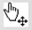
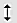
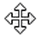
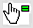

# Меню Tools

<strong> Trace Angle Lock (CRTL+K)</strong> – запрет изменения угла разводки дорожки; ограничивает разводку участков дорожки только углами 90 и 45 градусов. Инструмент <strong> Trace Angle Lock</strong>  также может помочь при разводке дорожки, когда одна из контактных площадок находится не в точках сетки, т. е. проводимая дорожка не будет совпадать с центром контактной площадки. При включенном инструменте <strong>Trace Angle Lock</strong>  щелчок на контактной площадке вне точек сетки запустит <strong>Trace Angle Fixup</strong> (Коррекцию угла дорожки), которая переместит дорожку так, чтобы выполнялись правила запрета изменения угла дорожки. Инструменты <strong>Trace Angle Lock</strong> и <strong>Trace Angle Fixup</strong> активны по умолчанию. Пользователь может отключить их или включить повторно, сняв или установив галочку.

<strong>Auto Trace Selection (CTRL+T)</strong> – позволяет автоматически выбирать соответствующие стили дорожек и переходных отверстий для заданной цепи, в зависимости от класс цепи, к которой они относятся. Эта функция может быть отключена, сняв галочку, например, если различные части дорожки должны иметь разную толщину.

<strong>Auto Track Necking (CTRL+N)</strong> – позволяет автоматически уменьшить размер дорожки, чтобы её можно было провести между двумя контактными площадками или другими препятствиями без нарушения правил проектирования. Функция настраивается командой <strong>Set Design Rules</strong> из меню <strong>System</strong>. Диалоговое окно позволяет выбрать из выпадающего списка стиль дорожки, который необходимо использовать для уменьшения дорожки. По умолчанию таким стилем дорожки является T10 – дорожка толщиной 10 мил.

Чтобы полностью отключить <strong>Auto Track Necking</strong>, снимите галочку с команды. При этом значительно увеличивается скорость размещения дорожек, поскольку выполняется сложный анализ при включенной функции <strong>Auto Track Necking</strong>.

При использовании <strong>Auto Track Necking</strong> ARES также проверяет физические нарушения правил проектирования. Сначала программа попытается уменьшить размер дорожки, чтобы избежать их, но если нарушение не исчезнет, то выдаст предупреждение и звуковой сигнал. Дорожка, тем не менее, разведется. Этот процесс требует больше времени и в случае значительного увеличения времени разводки, можно попытаться отключить функцию <strong>Auto Track Necking</strong>.

<strong>Auto Zone Regeneration (CTRL+R)</strong> – позволяет автоматически перерисовывать области металлизации после их редактирования.

<strong>Search and Tag… (T)</strong> – поиск и выделение в пределах проекта компонента или другого объекта, соответствующего определенным критериям (Рис. 46). Этот критерий определяется свойствами объекта, по которым происходит поиск. В выпадающем списке <strong>Field</strong> выбирается общее свойство для объектов: REF – обозначение, VALUE – номинал (название) или PACKAGE – корпус. В поле <strong>String</strong> (Строка поиска) вводится конкретная строка поиска (например: R2, С3 или U10 для свойства REF). Затем после нажатия на кнопку <strong>OK</strong>, происходит выделение всех найденных элементов. В разделе <strong>Mode</strong> выбирается условие поиска: <strong>Equals</strong> – совпадает, <strong>Begins</strong> – начинается, <strong>Contains</strong> – содержит, <strong>Not Equals</strong> – не совпадает, <strong>Not Begins</strong> – не начинается, <strong>Not Contains</strong> – не содержит. В разделе <strong>Range</strong> определяется диапазон слоев, в пределах которого происходит поиск: <strong>Top</strong> – верхний медный слой; <strong>Bottom</strong> – верхний медный слой; <strong>All</strong> – все слои. Команда производит новый поиск без учета ранее найденных компонентов.

<strong>OR Search and Tag…</strong> – аналогична команде <strong>Search and Tag…</strong>, но позволяет добавить найденные объекты к выделенным ранее.

<strong>AND Search and Tag…</strong> – аналогична команде <strong>Search and Tag…</strong>, но осуществляет поиск среди уже выделенных объектов.

Рис. 46

<strong>Auto Name Generator…</strong> – позволяет автоматически изменить название и пронумеровать компоненты или контактные площадки на плате (Рис. 47).

Рис. 47

В поле <strong>String</strong> вводится строка, определяющая название компонентов, например, чтобы назвать три компонента DD1, DD2 и DD3, необходимо ввести в этой поле DD. В поле <strong>Count</strong> вводится начальное число, с которого необходимо начать нумерацию. После щелчка левой кнопкой на компоненте или контактной площадке число автоматически увеличивается на единицу.

Рассмотрим различные виды курсора при редактировании проекта, поскольку при использовании команды <strong>Auto Name Generator…</strong> характерно меняется вид курсора. ARES динамически изменяет вид курсора, подсказывая пользователю, что произойдет при щелчке левой кнопкой мыши в каждый момент времени. В таблице 1 приведены различные виды курсора в зависимости от выполняемой функции.

Таблица 1 – Виды курсора в ARES.

<table style="text-align:center;">
<tbody>
<tr>
<td><strong>Вид курсора</strong></td>
<td><strong>Описание</strong></td>
</tr>
<tr>
<td></td>
<td>Стандартный курсор, отображается пока курсор находится над свободной область печатной платы</td>
</tr>
<tr>
<td></td>
<td>Вид курсора при активированной функции размещения объекта (щелчок левой кнопкой мыши размещает объект)</td>
</tr>
<tr>
<td></td>
<td>Вид курсора при активированной функции выбора объекта (щелчок левой кнопкой мыши выделяет объект)</td>
</tr>
<tr>
<td></td>
<td>Вид курсора при активированной функции перемещения объекта (переместить выделенный объект можно, зажав левую кнопку мыши)</td>
</tr>
<tr>
<td></td>
<td>Дорожка может быть сдвинута при удержании левой кнопки мыши</td>
</tr>
<tr>
<td></td>
<td>Вид курсора при активированной функции перемещения группы выделенных объектов (переместить выделенную группу объектов можно, зажав левую кнопку мыши)</td>
</tr>
<tr>
<td></td>
<td>При использовании функции <strong>Auto Name Generator</strong> щелчок левой кнопкой назначит новое название и номер объекту под курсором</td>
</tr>
</tbody>
</table>

<strong>Design Rule Manager…</strong> – настройка встроенной системы проверки правил проектирования для предупреждения пользователя в случаях, когда зазоры между объектами на печатной плате меньше, чем необходимо для проекта. При разводке новой печатной платы прежде всего рекомендуется настроить эту функцию; это не только позволит избежать ошибок, но и учитывать алгоритмами авто- и ручной разводки указанные значения толщин дорожек и зазоров. Данная система основывается на четырех ключевых понятиях: классах цепей; зазорах при проектировании; правилах проектирования и состоянии программы проверки правил проектирования печатной платы.

<strong>Классы цепей</strong>

Класс цепи – это цепь или группа цепей, которые имеют одинаковые электрические характеристики (например, питающие). Как только определен класс цепи, пользователь может управлять толщиной дорожки, стилями переходных отверстий и наборами пар слоев для этого класса, а также зазорами, создавая правила проектирования, связанные с этим классом. Смотри также раздел «Классы цепей» и пояснения к вкладке <strong>Net Classes</strong> команды <strong>Design Rule Manager</strong>.

<strong>Зазоры при проектировании</strong>

Существует множество физических зазоров (минимально допустимых расстояний) при проектировании, которые можно настроить для обеспечения их проверки в реальном времени во время разводки платы. В частности, следующие зазоры  можно настроить по отдельности:

<ul>
<li>Pad - Pad Clearance (зазоры между контактными площадками);</li>
<li>Pad - Track Clearance (зазоры между контактной площадкой и дорожкой);</li>
<li>Pad - Track Clearance (зазоры между дорожками);</li>
<li>Graphics Clearance (зазоры между двумерной графикой и другими объектами);</li>
<li>Edge/Slot Clearance (зазоры между краем платы и другими объектами).</li>
</li>
</ul>

<strong>Правила проектирования</strong>

Правила проектирования являются настраиваемыми параметрами, с помощью которых осуществляется редактирование зазоров, применяемых к печатной плате. В простейшем случае значения по умолчанию для этих параметров (правило DEFAULT) определяют зазоры, которые применяются ко всем слоям и всем классам цепей; другими словами, они определяют допуски при производстве платы. Кроме этого, ARES позволяет определить правила для каждого частного случая. Например, пользователь может задать разные значения зазоров для конкретного слоя или конкретного класса цепей.

<strong>Состояние программы проверки правил проектирования печатной платы</strong>

Состояние программы проверки правил проектирования печатной платы – это окно, отслеживающее и отображающее в реальном времени (расположенное по умолчанию в нижней правой части ARES) нарушения текущих правил проектирования и значений зазоров, определенных для печатной платы. Смотри также раздел «Состояние программы проверки правил проектирования печатной платы».

После вызова команды открывается диалоговое окно, состоящее из двух вкладок, показанное на Рис. 48.

Рис. 48

В первой вкладке Design Rules определяются дополнительные правила проектирования для текущего проекта, позволяющие задавать различные значения для зазоров в зависимости от расположения объектов (правила проектирования для слоев), из электрических соображений (правила проектирования для класса цепи) или учитывая оба этих фактора. ARES позволяет определить любое количество таких правил при проектировании. Таким образом, необходимо добавлять новое правило проектирования для каждого требования к зазорам на печатной плате, которые отличаются от допусков при производстве (правило DEFAULT).

В верхней части вкладки можно создавать (кнопка New), переименовывать (кнопка Rename) и удалять (кнопка Delete) правила проектирования или выбирать существующее правило для редактирования из списка соединений. Правило DEFAULT является глобальным правилом для допусков и таким образом не редактируемо (его нельзя удалить). Оно применяется для всех слоев и всех классов цепей.

После создания нового правила пользователь может определить:

<ul>
<li>будет ли это правило применяться ко всем слоям или к определенному выбранному слою (выпадающий список Apply to Layer);</li>
<li>будет ли это правило применяться к определенному классу цепей или ко всем классам (выпадающий список Apply to Net Class). Заметьте, что правило DEFAULT применяется ко всем классам цепей и что только в этом выпадающем списке появляются только классы цепей, имеющие название на принципиальной схеме;</li>
<li>будет ли данное правило применяться (раздел With Respect To) только в пределах этого же класса цепей (The Same Net Class), только относительно других классов цепей (Other Net Classes) или для всех классов цепей (All Net Classes). Заметьте, что если пользователь выбирает The Same Net Class или Other Net Classes, то зазоры между двумерной графикой, краями платы и объектами будут недоступны для редактирования, поскольку эти объекты не определены для класса цепи и значение зазоров в этом случае неизвестно. Эти зазоры игнорируются для такого правила. Раздел With Respect To неактивен, если текущее редактируемое правило применяется ко всем классам цепей (поле All Classes в выпадающем списке Apply to Net Class).</li>
</ul>

В правой части вкладки определяются минимальные зазоры для правила, создаваемого в текущий момент: Pad - Pad Clearance; Pad - Track Clearance; Pad - Track Clearance; Graphics Clearance; Edge/Slot Clearance. Кнопка Apply Defaults присвоит этим зазорам значения, определенные в правиле DEFAULT, которое настраивается командой Set Default Rule из меню System.

Установленный флажок Enable Design Rule Checking? позволяет включить или выключить проверку выбранного правила в реальном времени.

<strong>Иерархия правил проектирования</strong>

Если пользователь создает несколько правил проектирования, которые потенциально могут пересекаться друг с другом, необходимо понимать как работает система правил проектирования.

ARES поддерживает иерархию типов правил в порядке возрастания приоритета. Правило с большим приоритетом будет превосходить пересекающееся с ним правило, которое имеет меньший приоритет. Когда два правила имеют одинаковый приоритет и они пересекаются, будет использоваться правило, которое имеет большее значение зазора.
Правила определенные для конкретных объектов будет иметь больший приоритет по сравнению с общими правилами; например, правило, использующееся для определенного слоя, будет иметь больший приоритет по сравнению с правилом DEFAULT, которое применяется для всей платы.

Ниже дается пояснение по типам правил, начиная с самого нижнего уровня приоритета в иерархии правил и заканчивая самым высоким уровнем приоритета в иерархии.

<strong>Правила для печатной платы (PCB Rule)</strong>

Эти правила применяются ко всем слоям на плате и ко всем электрическим классам цепей. Существует только одно правило для печатной платы и этим правилом является заранее определенное правило DEFAULT (Рис. 49).

Рис. 49

Правило DEFAULT не может быть удалено по очевидным причинам и его нельзя изменить так, чтобы оно действовало для определенных слоев или классов цепей.

Правило DEFAULT имеет низший приоритет в дереве приоритетов правил проектирования; это означает, что любые дополнительные правила проектирования, действующие для определенного слоя или класса цепи, будут применяться вместо него.

<strong>Правило для слоя (Per Layer Rule)</strong>

Правило для слоя – это правило с зазорами, которые применяют для всех классов цепей, но в одном слое на печатной плате (Рис. 50).

Правило для слоя имеет более высокий приоритет по сравнению с правилом для печатной платы, но более низкий по сравнению со всеми другими типами правил.

Рис. 50

<strong>Правило для класса цепи (для всех слоев) (Per Net Class Rule (All Layers))</strong>

Правила для класса цепи – это правило с зазорами, которые применяются к заданному классу цепи на всех слоях печатной платы (Рис. 51).

Эта правило имеет более высокий приоритет по сравнению с правилами для печатной платы и любым правилом для слоя.

Рис. 51

<strong>Правило для класса цепи (для одного указанного слоя) (Per Net Class Rule (Per Layer))</strong>

Это правило, при котором зазоры применяются для определенного класса цепи на определенном слое (Рис. 52).

Этот тип правил имеет более высокий приоритет по сравнению вышеприведенными правилами и в частности над правилом для класса цепи (для всех слоев).

Рис. 52

<strong>Правило для класса цепи внутри этого класса (для всех слоев) Inter Net Class (All Layer)</strong>

Правило для класса цепи внутри этого класса – это правило, при котором зазоры применяются к определенному классу цепи, но относительно или самого себя или ко всем другим классам цепей (Рис. 53). Другими словами, такое правило, что зазоры применяются только между дорожками и контактными площадками одного и того же класса цепи или такое правило, что зазоры применяются только между дорожками и контактными площадками одного класса цепи относительно всех дорожек и контактных площадок всех других классов цепей.

В этом случае правило для класса цепи внутри этого класса применяется ко всем слоям; оно имеет второй по старшинству приоритет.

Рис. 53

<strong>Правило для класса цепи внутри этого класса (для указанного слоя) Inter Net Class (Per Layer)</strong>

Это правило аналогично предыдущему, за исключением того, что применяется к определенному слою (Рис. 54). Оно имеет наивысший приоритет и будет преобладать над любым другим типом правил, с которым пересекается.

Рис. 54

<strong>Примеры правил проектирования</strong>

Рассмотрим некоторые примеры, связанные с типами правил. Пусть была создана принципиальная схема, список соединений и теперь необходимо создать набор правил, чтобы определить ограничения, накладываемые при проектировании печатной платы. Чтобы создать правило, управляющее зазорами на верхнем медном слое, необходимо:

<ol>
<li>Вызвать команду Design Rule Manager из меню Tools.</li>
<li>Нажать на кнопку New вверху диалогового окна и ввести название для правила (например, LAYER_TOP).</li>
<li>Изменить слой в разделе Apply to Layer на Top Copper.</li>
<li>Изменить зазоры как необходимо и нажать кнопку OK, чтобы сохранить изменения и выйти из диалогового окна.</li>
</ol>

Чтобы создать правило, управляющее зазорами для класса цепей SIGNAL:

<ol>
<li>Вызвать команду Design Rule Manager из меню Tools.</li>
<li>Нажать на кнопку New вверху диалогового окна и ввести название для правила (например, SIGNAL_ALL).</li>
<li>Изменить класс цепи в разделе Apply to Net Class на SIGNAL.</li>
<li>Изменить зазоры как необходимо и нажать кнопку OK, чтобы сохранить изменения и выйти из диалогового окна.</li>
</ol>

Чтобы создать правило, управляющее зазорами для класса цепей SIGNAL относительно его самого на верхнем медном слое:

<ol>
<li>Вызвать команду Design Rule Manager из меню Tools.</li>
<li>Нажать на кнопку New вверху диалогового окна и ввести название для правила (например, SIGNALSIGNAL_TOP).</li>
<li>Изменить слой в разделе Apply to Layer на Top Copper.</li>
<li>Изменить класс цепи в разделе Apply to Net Class на SIGNAL.</li>
<li>Выбрать The Same Net Class в разделе With Respect To диалогового окна.</li>
<li>Изменить зазоры как необходимо и нажать кнопку OK, чтобы сохранить изменения и выйти из диалогового окна.</li>
</ol>

Таким образом, было создано три дополнительных правила, кроме одного правила по умолчанию (правило DEFAULT), которое существует для всех проектов. Все четыре правила пересекаются на верхнем медном слое, поэтому продолжим рассмотрение поведения системы правил проектирования для этой печатной платы.

Контактные площадки и дорожки класса цепи SIGNAL, которые находятся на верхнем медном слое (Top Copper) и имеют метку, сигнализирующую об ошибке правил проектирования, должны иметь зазоры относительно других контактных площадок и дорожек класса цепи SIGNAL меньше, чем те которые определены в правиле SIGNALSIGNAL_TOP.

Контактные площадки и дорожки класса цепи SIGNAL, которые находятся на любом другом слое отличном от верхнего медного и имеют метку, сигнализирующую об ошибке правил проектирования, должны иметь зазоры к любому другому объекту меньше, чем те, которые указаны в правиле SIGNAL_ALL. На верхнем медном слое нарушение правила SIGNAL_ALL будет возникать, если контактная площадка или дорожка класса цепей SIGNAL будет ближе к контактной площадке или дорожке другого класса цепей, чем зазоры, указанные в правиле SIGNAL_ALL.

Объекты на верхнем медном слое, которые не связаны с классом цепей SIGNAL, будут иметь метку, сигнализирующую об ошибке правил проектирования, если их зазор меньше, чем определено в правиле LAYER_TOP.

Объекты на любом другом слое отличном от верхнего медного, которые не связаны с классом цепей SIGNAL, будут иметь метку, сигнализирующую об ошибке правил проектирования, если их зазор относительно любого другого объекта не связанного с классом цепей SIGNAL меньше, чем определено в правиле по умолчанию DEFAULT.

При просмотре ошибок правил проектирования, отображается правило, которое вызвало ошибку и слой, на котором возникла эта ошибка (Рис. 55).

Рис. 55

В общем случае при создании правил проектирования для печатной платы, необходимо перемещаться по иерархии правил проектирования снизу вверх, создавая дополнительные уточняющие правила проектирования, после того как созданы любые менее строгие – общие.

Во второй вкладке Net Classes определяются настройки классов цепей (Рис. 57). При проектировании печатной платы пользователю бывает необходимо использовать различную толщину дорожек для различных типов соединений. Также, скорее всего, необходимо задавать различные зазоры и разводить различные участки принципиальной схемы на разных слоях. Всем этим можно управлять, назначая группе соединений с одинаковыми электрическими характеристиками, класс цепи. Это осуществляется на принципиальной схеме, размещая метку на любом проводнике цепи вида «CLASS=&lt;название класса&gt;», чтобы обозначить, что цепь принадлежит к названному классу цепи (Рис. 56).

Рис. 56

ARES считывает все названные классы цепей из принципиальной схемы и отображает их на вкладке Net Classes команды Design Rule Manager (Рис. 57).

Рис. 57

Если класс цепи не появился в выпадающем списке, следовательно, он был не назван/не правильно определен на принципиальной схеме.

Как только пользователь выбрал класс цепи в выпадающем списке, можно настроить параметры, указанные в таблице 2.

Таблица 2 – Параметры классов цепей.

<table>
<tbody>
<tr>
<td style="border:1px solid #000; text-align:center;"><strong>Параметр</strong></td>
<td style="border:1px solid #000; text-align:center;"><strong>Описание</strong></td>
</tr>
<tr>
<td style="border:1px solid #000; text-align:center;">Routing Styles (Стили разводки дорожек)</td>
<td style="border:1px solid #000;">Эти параметры позволяют определить стиль дорожек Trace Style, стиль сужения дорожек Neck Style (для сужений при разводке между контактными площадками для поверхностного монтажа) и стиль переходных отверстий Via Style, которые используются при разводке выбранного класса цепи.</td>
</tr>
<tr>
<td style="border:1px solid #000; text-align:center;">Via Type (Тип переходных отверстий)</td>
<td style="border:1px solid #000;">Определяет тип переходных отверстий для выбранного класса цепи:
<ul>
<li>Normal (обычное);</li>
<li>Top blind (между верхним медным и внутренним слоем);</li>
<li>Bottom blind (между нижним медным и внутренним слоем);</li>
<li>Buried (между внутренними слоями платы).</li>
</ul>
Этот параметр связан с разделом, касающимся выбора пар слоев для авторазводки, например, если пользователь выбирает Top blind и пару слоев Top Copper и Inner 1, то переходное отверстие будет находиться между этими двумя слоями.
</td>
</tr>
<tr>
<td style="border:1px solid #000; text-align:center;">Ratsnest Display (Отображение линий связи)</td>
<td style="border:1px solid #000;">Часто удобно (особенно для сложных плат) задавать разный цвет линий связи для различных классов цепей, чтобы отличать их на плате (параметр Colour). Подобным образом, чтобы уменьшить число отображаемых линий связи, пользователь может скрыть их для определенного класса цепей (установленный флажок Hidden?).</td>
</tr>
<tr>
<td style="border:1px solid #000; text-align:center;">Layer Assignment for Auto-Routing (Выбор пар слоев для авторазводки)</td>
<td style="border:1px solid #000;">Каждый класс цепи может иметь до 8 пар слоев, на которых авторазводчиком будут разводиться соединения, связанные с ним. В слое (Hoz) преимущественно разводятся горизонтальные дорожки, а в слое (Vert) – преимущественно вертикальные. Если класс цепи должен разводиться только на одном слое, то необходимо выбрать одинаковый слой для горизонтальных и вертикальных дорожек.   Кроме определения на каких слоях и используя какие стили разводить класс цепи, пользователь может также задать ограничения с помощью зазоров относящиеся к конкретному классу цепи. Это можно сделать, добавляя и определяя правила класса цепи во вкладке Design Rules диалогового окна.</td>
</tr>
<tr>
<td style="border:1px solid #000; text-align:center;">Priority (Приоритет)</td>
<td style="border:1px solid #000;">Параметр определяет для авторазводчика очередность разводки класса цепи. Класс цепи, имеющий наименьшее значение (наивысший приоритет), разводится первым. Классы цепи с одинаковыми приоритетами разводятся одновременно. Назначение разных приоритетов классам цепей приводит к увеличению времени, которое требуется для авторазводки, но в то же время обычно увеличивается и число разведенных дорожек по сравнению со случаем, когда все классы цепей разводятся одновременно, особенно для односторонних плат.</td>
</tr>
</tbody>
</table>

Auto Placer… – запускает диалоговое окно автоматического размещения элементов (Рис. 58). Как и при авторазводке, авторазмещение не всегда выполняется идеально во всех случаях, по сравнению с ручным размещением, но с другой стороны это позволяет сэкономить время и облегчить работу разработчика. Кроме того, после авторазмещения компоненты могут быть отредактированы вручную.

Рис. 58

Для правильной работы, алгоритму необходимо знать только границы печатной платы (это можно сделать, поместив замкнутый многоугольник в слое Board Edge) и иметь загруженный список соединений для определения размещаемых компонентов. Последовательность действий, необходимая для авторазмещения компонентов приведена ниже:

<ol>
<li>Создайте принципиальную схему в ISIS, присвоив групповые свойства тем компонентам, которые должны быть физически расположены ближе друг к другу на конечной плате.</li>
<li>Вызовите команду Netlist to ARES из меню Tools в ISIS.</li>
<li>Нарисуйте границы печатной платы, используя инструменты двумерной графики в слое Board Edge. Удостоверьтесь, что границы представляют собой замкнутый многоугольник. Для этого лучше всего использовать объект 2D Graphics Closed Path Mode из левой панели инструментов.</li>
<li>Разместите любые компоненты, которые не должны изменять своего местоположения на плате. Компоненты, размещенные вручную, считаются неперемещаемыми и рассматриваются при авторазмещении как препятствия.</li>
<li>Выберите команду Auto Placer… из меню Tools в ARES и настройте необходимые параметры.</li>
<li>Выберите те компоненты из списка, которые нужно разместить автоматически.</li>
<li>Измените весовые коэффициенты и правила проектирования так, чтобы они соответствовали требованиям, которые предъявляются к размещению компонентов плате.</li>
<li>Нажмите кнопку OK.</li>
<li>Переместите и поверните компоненты и опять запустите алгоритм авторазмещения.</li>
<li>После окончания работы алгоритма авторазмещения вручную разместите любые оставшиеся компоненты и начните разводку печатной платы.</li>
</ol>

Алгоритм авторазмещения имеет множество настроек, однако, для большинства задач достаточно будет использовать значения доступные по умолчанию.

В левой части диалогового окна показан список компонентов, которые еще нужно разместить на плате, причем, когда диалоговое окно выдается в первый раз, все компоненты выделены и представлены в алфавитном порядке (Рис. 58).

Кнопка All выделяет все компоненты, а кнопка None – снимает выделение со всех компонентов. По умолчанию все компоненты приведены в алфавитном порядке, но нажатие на кнопку Schedule они будут приведены в том порядке, в котором будут выбираться алгоритмом авторазмещения. В этом случае компоненты, не выбранные для авторазмещения, приводятся в конце списка в алфавитном порядке.

Раздел Design Rules диалогового окна позволяет настроить правила, которые используются для размещения компонентов на плате. Поле Placement Grid определяет размер шага сетки, используемый алгоритмом авторазмещения, при попытке поиска положения для каждой компоненты. Оно всегда должно быть кратно размеру сетки, который будет использоваться для авторазводки. Значения могут задаваться в диапазоне от 10 мил до 1 дюйма, хотя чаще всего они равны 100, 50 или 25 мил. Поле Edge Boundary определяет минимальное допустимое расстояние между любым компонентом и краем платы, изображенным в слое Board Edge. Значения могут задаваться в диапазоне от 1 мил до 1 дюйма.

В разделе Preferred DIL rotation определяется предпочтительная ориентация для DIL корпусов. Она принята горизонтальной (переключатель Horizontal) по умолчанию, но форма платы может приводить к тому, что вертикально расположенные корпуса (переключатель Vertical) будут лучше использовать доступное пространство платы.

Дополнительные возможности для авторазмещения указаны в разделе Options. Установленный флажок Push &amp; Shove позволяет настроить перемещение уже размещенных элементов. Алгоритм авторазмещения распознает два типа компонентов: предварительно размещенные пользователем, которые считаются неподвижными и размещаемые самим алгоритмом, которые могут затем перемещаться пользователем. Последние могут сдвигаться относительно платы, чтобы наилучшим образом расположить оставшиеся компоненты. Эти перемещения ограничены для плат, в которых предварительно размещенные компоненты находятся в центре платы, поэтому в этом случае лучше отключить этот флажок.

Установленный флажок Swap Pass позволяет настроить Возможность замены корпусов. Поскольку компоненты размещаются последовательно, улучшения авторазмещения можно добиться заменой типа корпуса, после того как размещены все элементы.

Алгоритм авторазмещения использует метод проб и ошибок, пытаясь расположить следующий элемент в различных положениях на плате так, чтобы минимизировать множество ключевых параметров, которые приведены в разделе Trial Placement Cost Weightings. Относительная важность этих параметров задается разработчиком, увеличивая (более важные) или уменьшая (менее важные) значения в следующих семи полях, указанных в таблице 3.

Таблица 3 – Ключевые поля раздела Trial Placement Cost Weightings

<table>
<tbody>
<tr>
<td style="border:1px solid #000; text-align:center;"><strong>Поле</strong></td>
<td style="border:1px solid #000; text-align:center;"><strong>Описание</strong></td>
</tr>
<tr>
<td style="border:1px solid #000; text-align:center;">Grouping (Группировка по элементам)</td>
<td style="border:1px solid #000;">Часто необходимо принудительно расположить два (или более) компонента рядом друг с другом (например, фильтрующие конденсаторы); это можно сделать двумя способами. Во-первых, вручную отредактировать их расположение, перемещая компоненты в нужную позицию на плате, однако, при этом не используется авторазмещение. Во-вторых, разработчик может указать алгоритму авторазмещения какие компоненты должны быть сгруппированы друг с другом.  
Для этого нужно использовать свойство GROUP в ISIS. Например, если фильтрующий конденсатор C1 должен фильтровать напряжение, подаваемое на микросхему U1, то необходимо добавить в свойства конденсатора поле 
GROUP=U1 
В этом случае при автоматическом размещении C1 более высокие веса будут иметь местоположения на плате, находящие далеко от U1, что приведет к близкому размещению конденсатора C1 к микросхеме U1. 
Если необходимо сгруппировать несколько компонентов вместе, то всем им можно дать одно и то же название для группы, т. е., для группировки компонентов U1, U2, U3, C1 и C5 можно назначить каждому компоненту свойство «GROUP=TIMER». Для редактирования большого количества компонентов удобно использовать Property Assignment Tool в ISIS.</td>
</tr>
<tr>
<td style="border:1px solid #000; text-align:center;">Ratsnest Length (Длина линий связи между элементами)</td>
<td style="border:1px solid #000;">Вероятно являясь самым главным весовым коэффициентом в смысле разводки дорожек, он определяет важность минимизации длины связей компонентов перед разводкой. Тем не менее, как показывает практика необходимо находить компромисс между длиной линии связи и количеством их пересечений. Плата с минимальной общей длиной линий связей, но с большим числом их пересечений часто является не поддающейся разводке.
</td>
</tr>
<tr>
<td style="border:1px solid #000; text-align:center;">Ratsnest Display (Отображение линий связи)</td>
<td style="border:1px solid #000;">Часто удобно (особенно для сложных плат) задавать разный цвет линий связи для различных классов цепей, чтобы отличать их на плате (параметр Colour). Подобным образом, чтобы уменьшить число отображаемых линий связи, пользователь может скрыть их для определенного класса цепей (установленный флажок Hidden?).</td>
</tr>
<tr>
<td style="border:1px solid #000; text-align:center;">Ratsnest Crossings (Пересечение линий связей)</td>
<td style="border:1px solid #000;">Этот весовой коэффициент определяет важность минимизации количества линий связей, которые пересекаются. При перемещении компонента по плате меняется как длина линии связи, так и число её пересечений с другими линиями, причем оба этих фактора будут влиять на конечную возможность разводки платы после окончательного размещения элементов. Таким образом, должен существовать баланс между этим параметров и длиной линии связи.</td>
</tr>
<tr>
<td style="border:1px solid #000; text-align:center;">Congestion (Плотность размещения элементов)</td>
<td style="border:1px solid #000;">Небольшие компоненты, такие как резисторы и конденсаторы, могут быть расположены вдали от зон на плате с большим количеством элементов, увеличивая важность этого весового коэффициента. Заметьте, что когда такой компонент связан с другим компонентов свойством GROUP, то значение весового коэффициента Congestion для него игнорируется.</td>
</tr>
<tr>
<td style="border:1px solid #000; text-align:center;">DIL packages (корпуса с двумя рядами выводов по длинным сторонам):  
DIL Rotation 90 
DIL Rotation 180 
</td>
<td style="border:1px solid #000;">Компоненты, которые имеют DIL корпуса, размещаются по-особому. В общем случае, необходимо расположить DIL корпуса так, чтобы они имели одну и ту же ориентацию. Для этого используются раздел диалогового окна Preferred DIL rotation, весовые коэффициенты DIL Rotation 90 и DIL Rotation 180. Предпочтительной ориентацией DIL корпусов (Preferred DIL rotation) по умолчанию является горизонтальная (Horizontal), но форма печатной платы может приводить к тому, что DIL корпуса, размещенные вертикально (Vertical), будут лучше использовать доступное пространство платы. Два весовых коэффициента определяют насколько штрафуется компоненты, если он размещается под углом 90 или 180 градусов относительно ориентации по умолчанию. Если ориентация DIL корпусов не имеет значения, присвойте этим коэффициентам нулевые значения.</td>
</tr>
<tr>
<td style="border:1px solid #000; text-align:center;">Alignment (Расположение компонентов)</td>
<td style="border:1px solid #000;">О качестве печатной платы можно судить не только по её разводке, но и по её внешнему виду. Внешний вид печатной платы определяется расположением её компонентов. Этот весовой коэффициент определяет важность совмещения краев компонентов. Увеличение этого коэффициента также способствует облегчению разводки печатной платы, поскольку, если края компонентов совмещены, то будут совмещены и их выводы.</td>
</tr>
</tbody>
</table>

Кнопка Restore Defaults восстанавливает значения весовых коэффициентов, принятые по умолчанию.

<strong>Область, занимаемая компонентом (Occupancy)</strong>

Каждый компонент, который размещается на плате, рассматривается как препятствие для элементов, которые ещё на ней не расположены. По умолчанию область, которую занимает компонент, предполагается равной наименьшему прямоугольнику, который содержит все шелкографию и выводы компонента. Любые две таких прямоугольника не должны ни касаться друг друга, ни пересекаться.

Часто нужно изменить область, занимаемую объектом, например, чтобы DIL корпус занимал дополнительное пространство по краям, где расположены выводы или чтобы увеличить область разъема только с одной стороны. Для этого в ARES используется слой Occupancy, на который можно размещать двумерную графику, подобно слою шелкографии.

Двумерная графика, определяющая область, занимаемую объектом, обычно не видна, но её можно увидеть и отредактировать, разбив корпус, изменив или добавив необходимую графику и затем вызвав команду Make Package из меню Tools.

Чтобы отредактировать область, занимаемую объектом, для корпуса, необходимо:

<ol>
<li>Поместить копию корпуса на печатную плату.</li>
<li>Выделить её и вызвать команду Decompose из меню Library.</li>
<li>Выбрать слой Occupancy в селекторе объектов.</li>
<li>Поместить прямоугольник или окружность, определяющую область, занимаемую объектом.</li>
<li>Выделить все элементы корпуса.</li>
<li>Использовать команду Make Package, чтобы сохранить произведенные изменения в библиотеке.</li>
</ol>

Для определения области, занимаемой объектом, можно также использовать несколько прямоугольников или окружностей, но не многоугольник. Это ограничение будет устранено в последующих версиях программы.

<strong>Ограничения при использовании авторазмещения</strong>

Алгоритм авторазмещения имеет несколько ограничений:

<ul>
<li>он может размещать компоненты только на верхней стороне платы. Платы, на которых требуется двухстороннее размещение элементов, не поддерживаются.</li>
<li>хотя алгоритм авторазмещения может работать с платами, на которые были предварительно размещены некоторые компоненты, чем больше таких элементов на плате, тем хуже он работает. Если возможно, лучше позволить алгоритму расположить все элементы, а затем переместить их вручную как необходимо.</li> <li>Предварительное расположение компонентов в центре платы ухудшит также его производительность, поскольку это влияет на возможность сдвига компонентов при расположении. Если необходимо предварительно разместить компоненты в центре платы лучше убрать флажок Push &amp; Shove, однако в общем случае, алгоритм все равно будет работать плохо.</li>
<li>платы с не прямоугольными границами также влияют на возможность сдвига компонентов при расположении и ухудшают работу алгоритма.</li>
</ul>

Эти ограничения будут устранены в последующих версиях программы.

Auto Router – запускает диалоговое окно автоматической разводки печатной платы (Рис. 59). Авторазводчик ARES – один из наиболее мощных инструментов Proteus VSM, позволяющий сохранять время и труд разработчика. Он использует передовые алгоритмы разводки с нерегулярной сеткой. В отличие от традиционных алгоритмов с регулярной сеткой, эти алгоритмы позволяют более эффективно использовать область печатной платы и лучше удовлетворяют сложным правилам проектирования печатных плат с высокой плотностью элементов. Кроме архитектуры с нерегулярной сеткой, авторазводчик ARES использует адаптивный многопроходный алгоритм разрешения конфликтов с применением весовых коэффициентов для разводки дорожек. Вначале авторазводчик использует относительно маленькие веса для создания дорожек, которые могут иметь пересечения и/или зазоры, не удовлетворяющие правилам проектирования (конфликты). При последующих проходах весовые коэффициенты постепенно увеличиваются, пока не устранятся все конфликты. Этот адаптивный метод разводки доказал свою применимость при проектировании сложных печатных плат с высокой плотностью элементов.

Рис. 59

Авторазводчик ARES позволяет сократить время проектирования печатной платы. Однако, авторазводка происходит, следуя указаниям, задаваемым разработчиком и таким образом, чем больше указаний будет получено от пользователя, тем лучше будет разводка. ARES также имеет большую и гибкую систему правил проектирования, которая позволяет указать ряд ограничений и зазоров между элементами платы, толщину дорожек и стили переходных отверстий для цепей, которым присвоены названия (например, сигнальных или питающих) и даже слои, на которых необходимо развести указанные цепи. Все эти правила могут быть созданы и отредактированы, используя команду Design Rule Manager из меню Tools, и учитываются ARES при разводке платы.

Как только пользователь определил требуемые ограничения и вызвал авторазводчик, на панели задач внизу основного окна редактирования ARES будет отображаться текущий процент завершенных разведенных дорожек, а также дополнительная информация, касающаяся разводки. В частности, тип прохода, выполняющийся в текущий момент времени, номер текущего выполняющегося прохода, завершенность прохода, число конфликтов и процент завершения всей авторазводки (Рис. 60).

Рис. 60

Основная часть диалогового окна – раздел Execution Mode – позволяет пользователю выбрать один из четырех режимов работы:

<ul>
<li>автоматическая разводка (Run basic schedule automatically);</li>
<li>скриптовая разводка с запуском скриптового файла (Run specified DO file automatically);</li>
<li>интерактивная разводка с ручным вводом команд (Enter router commands interactively);</li>
<li>запуск авторазводчика ELECTRA (если он был приобретен отдельно) для разводки платы в нем (Launch external copy of ELECTRA).</li>
</ul>

Некоторые из этих режимов могут быть отключены в зависимости от типа используемой лицензии. Смотри также раздел «Режимы работы авторазводчика».

При автоматической разводке доступно несколько дополнительных параметров. Хотя в большинстве случаев достаточно использовать значения по умолчанию, настройка дополнительных параметров позволяет лучше разводить сложные платы или платы с плотным размещением элементов.

Поле Fanout Passes позволяет задать число проходов, во время которых автоматически разводятся короткие участки дорожек с переходным отверстием на конце, используемые для контактных площадок с поверхностным монтажом, позволяющие проще соединять их во время основных проходов, когда разводятся дорожки.

Поле Routing Passes определяет число основных проходов для разводок дорожек. Увеличение этого числа больше 50 практически не дает никакого эффекта; для сложных плат или плат с высокой плотностью элементов рекомендуется увеличить Repeat Phases, а не это число.

Поле Cleaning Passes позволяет задать число проходов по очистке, во время которых разрывается и заново разводится каждая цепь с большим коэффициентом для переходных отверстий и с нарушениями по зазорам и пересечениям. Значения по умолчанию достаточно для большинства плат.

Поле Repeat Phases определяет число повторений проходов разводки (Routing Passes) и очистки (Cleaning Passes). Авторазводчик ARES – это адаптивный авторазводчик с нерегулярной сеткой, поэтому повторение проходок разводки/очистки поможет достичь лучших результатов. Значения по умолчанию достаточно для большинства плат, но увеличение этого параметра может привести к улучшениям при разводке сложных плат или плат с высокой плотностью элементов.

Поле Filter Passes позволяет задать число фильтрующих проходок. Фильтрующая проход осуществляется после того как авторазводчик повторил проход разводки/очистки указанное в поле Repeat Phases число раз. Она удаляет все дорожки, имеющие конфликты на момент вызова проходки. Значение по умолчанию подходит для большинства плат.

Выпадающий список Recorner Pass определяет будут (значение в списке Yes) или не будут (значение в списке No) срезаться дорожки на плате. Этот проход осуществляется последним и изменяет угол разводки проводников с 90 градусов на 135, чтобы уменьшить общую длину дорожек.

В нижней части диалогового окна в разделе Design Rules приведены параметры, позволяющие дополнительно настроить авторазводчик и определить поведение алгоритмов разводки по умолчанию. Как и для параметров определенных выше, значений по умолчанию должно быть достаточно для большинства печатных плат.
Поле Wire Grid определяет сетку для разводки дорожек по умолчанию. Это размер сетки, который авторазводчик будет пытаться использовать при размещении дорожек, однако, в общем случае он не ограничивается разводкой дорожек, используя только эту сетку. Значения для этого параметра могут меняться в диапазоне от 1 мкм до 1 дюйма.

Поле Via Grid определяет сетку для разводки переходных отверстий по умолчанию. Это размер сетки, который авторазводчик будет пытаться использовать при размещении переходных отверстий, однако, в общем случае он не ограничивается разводкой переходных отверстий, используя только эту сетку. Значения для этого параметра могут меняться в диапазоне от 1 мкм до 1 дюйма.

Установленный флажок Allow Off Grid Routing? позволяет осуществлять разводку дорожек вне точек сетки. Эта функция, включенная по умолчанию, определяет ограничен ли авторазводчик разводкой дорожек только используя сетку (сеточный алгоритм разводки) или можно использовать точки вне сетки, когда это необходимо. Рекомендуется оставлять эту функцию включенной, поскольку её отключение плохо влияет на производительность авторазводчика в большинстве случаев.

Установленный флажок Enable autonecking? позволяет автоматически уменьшать размер дорожки, чтобы её можно было провести между двумя контактными площадками или другими препятствиями без нарушения правил проектирования при авторазводке. Стиль дорожки, который необходимо использовать для уменьшения дорожки настраивается командой Set Design Rules из меню System. По умолчанию таким стилем дорожки является T10 – дорожка толщиной 10 мил.

Авторазводчик ARES использует весовые коэффициенты, поэтому он сначала размещает все дорожки в соответствии с их «идеальным» положением, а затем увеличивает веса неправильно разведенных дорожек, пока не останется конфликтующих дорожек. Это означает, что в случае, если авторазводчик не сможет развести плату до конца и останутся неправильно разведенные дорожки на плате, то раздел Conflict Handling поможет настроить работу ARES c такими дорожками.

Если выбрать переключатель Treat conflicts as missings (Считать конфликты отсутствующими соединениями), то, когда работа авторазводчика прекращена или остановлена любые дорожки, которые пересекаются или считаются неправильно разведенными, удаляются с платы и восстанавливается соединение между контактными площадками в виде линии связи.

Если выбрать переключатель Load conflicts as illegal tracks (Считать конфликты неправильно разведенными дорожками), то все конфликты остаются на плате в виде неправильно разведенных дорожек. Они мигают желтым цветом и отображаются в списке нарушений правил проектирования. В случае отмены авторазводки пользователем число таких дорожек может быть очень большим и разводка их вручную может быть очень тяжелой или даже невозможной задачей.

Кнопка Begin Routing запускает авторазводчик и начинает авторазводку платы. Две дополнительные кнопки Export Design File и Import Session File, позволяющие экспортировать файл проекта из ARES c расширением *.EDF и импортировать файл сессии (сеанса) *.SES в ARES, используются пользователями, которые имеют авторазводчик SPECCTRA™. Кнопка Reset to Defaults сбросит все настраиваемые параметры в начальные значения, которые используются при первом запуске авторазводчика сразу после установки программы. Наконец кнопка Cancel позволяет вернуться в основное окно редактирования ARES без запуска авторазводчика.

Gateswap Optimizer – позволяет осуществить автоматическую оптимизацию путем перестановки эквивалентных выводов и/или элементов.

В случаях, когда проект имеет большое количество эквивалентных взаимозаменяемых элементов, очень сложно увидеть какая замена является наилучшей. Множество возможных комбинаций может быть очень большим даже для небольшого числа элементов.

Чтобы помочь найти оптимальное решение, ARES содержит автоматический оптимизатор замены элементов, который осуществляет тысячи элементарных замен таким образом, чтобы найти наилучший вариант для заданного размещения элементов на схеме. Во многих случаях он очень близок к оптимальному и почти всегда приводит к некоторому уменьшению общей длины линий связи.

Чтобы использовать оптимизатор замены элементов:

<ol>
<li>Загрузите список соединений проекта из ISIS. В ARES должна находиться копия списка соединений, которая синхронизирована с принципиальной схемой, перед тем как можно будет использовать эту функцию.</li>
<li>Поместите все компоненты как обычно, пытаясь достичь наименьшей длины связи.</li>
<li>Вызовите команду GateSwap Optimizer из меню Tools.</li>
</ol>

Алгоритм будет работать итеративно, пока нельзя будет добиться дальнейших улучшений. Время работы оптимизатора может быть достаточно большим (30 минут), если существует множество возможных замен.

GateSwap Optimizer основывается исключительно на данных о возможности перестановки элементов в библиотеках ISIS при определении можно ли осуществить замену или нет. Если в этих данных существуют ошибки, то могут возникнуть ошибки в проекте. Таким образом, необходимо тщательно проверять правильность осуществляемых перестановок и создавать макет печатной платы для проверки правильности работы перед массовым производством. Смотри также раздел «Перестановка эквивалентных выводов и/или элементов».

Power Plane Generator… – создает область металлизации, подключенную к определенной цепи, занимающей всю площадь выбранного слоя платы (Рис. 61).

Рис. 61

В открывшемся диалоговом окне можно выбрать цепь (Net), к которой будет подключена область металлизации. Если цепь не определена, то область металлизации будет соединена с любыми контактными площадками, которые имеют свойство Relief равное Thermal или Solid. В выпадающем списке можно выбрать только цепи, имеющие название. Пользователь может назвать цепь, помещая метку с названием, на любой проводник этой цепи в ISIS (иконка Wire Label Mode на левой панели инструментов).

Ниже из выпадающего списка выбирается слой (Layer) для области металлизации. Для выбора доступны все медные слои платы: Top Copper, Inner 1…Inner 14, Bottom Copper. Свойство Boundary позволяет выбрать из выпадающего списка стиль дорожки, с помощью которой рисуются внутренняя и внешняя границы области. Он также определяет наименьший участок меди, к которому может быть подсоединена область металлизации. Увеличение этого значения приведет к тому, что перестанут заполняться медью небольшие участки платы (например, между контактными площадками), а уменьшение значения – к тому, что различные участки платы будут соединяться узкими участками меди. Параметр Edge clearance определяет зазор между границами печатной платы и областью металлизации. Его используют, когда для свойства Boundary выбрана широкая дорожка и необходимо гарантировать, что она не выйдет за границы печатной платы. Диапазон значений для этого поля может изменяться в диапазоне от 0 до 1in (1 дюйм). Смотри также раздел «Области металлизации».

Component Re-Annotator – позволяет автоматически перенумеровать компоненты на печатной плате. Процесс начинается в верхней левой части платы и продолжается для всех компонентов, выбирая следующий ближайший еще не перенумерованный. Это можно также сделать вручную.

Чтобы повторно обозначить компоненты вручную:

<ol>
<li>Убедитесь, что в ARES загружена последняя версия списка соединений.</li>
<li>Выберите иконку Selection Mode в ARES и правильный слой для компонентов, которые необходимо повторно обозначить.</li>
<li>Дважды щелкните левой кнопкой мыши на названии компонентов, чтобы отредактировать их.</li>
</ol>

Пользователь получит сообщение об ошибке, если попытается осуществить изменения, которые не смогут обратно импортироваться в принципиальную схему. Примером могут быть разъемы, связанные с физическими терминалами, поскольку они не имеют названий в ISIS.

Чтобы повторно обозначить элементы автоматически нужно:

<ol>
<li>Определить любые компоненты, которые не нужно перенумеровать, определяя для них свойство NOANNOTATE=TRUE на принципиальной схеме.</li>
<li>Убедится, что в ARES загружена последняя версия списка соединений.</li>
<li>Вызвать команду Component Re-Annotator из меню Tools в ARES. Это перенумерует компоненты, используя их существующие названия и физическое положение на печатной плате.</li>
</ol>

